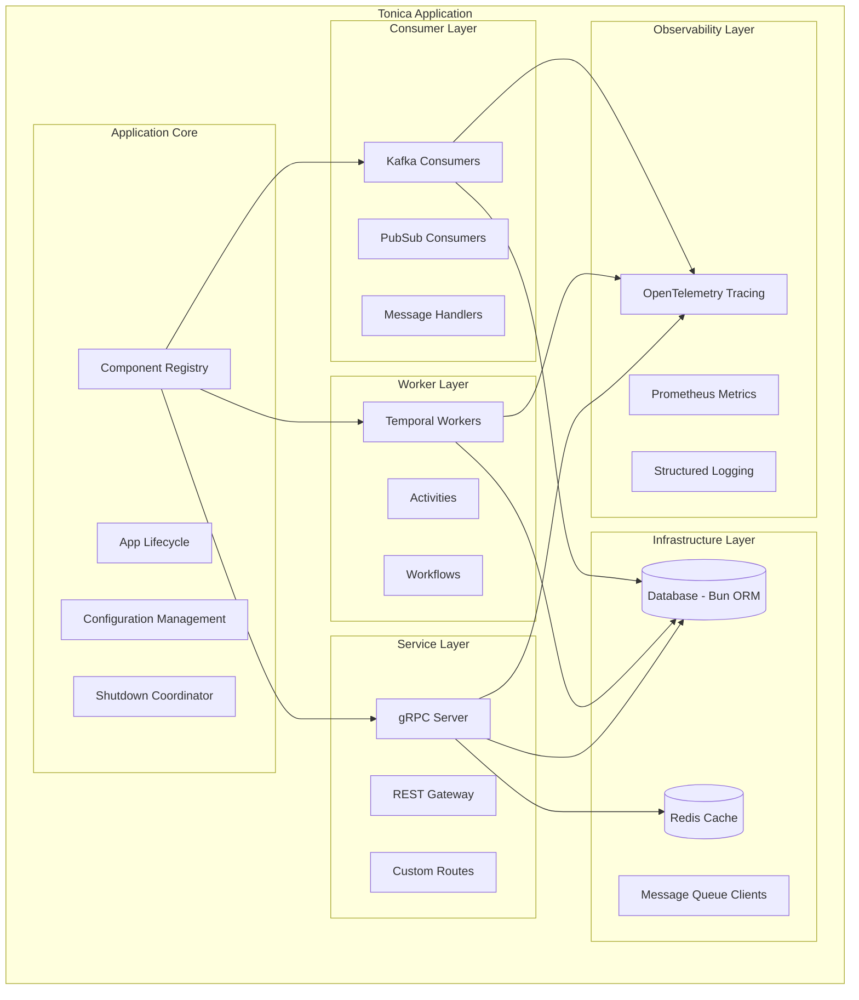
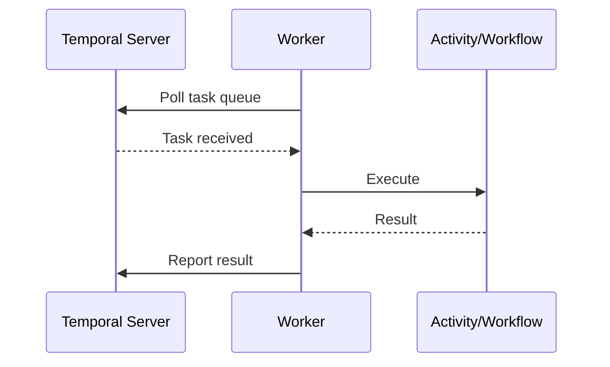
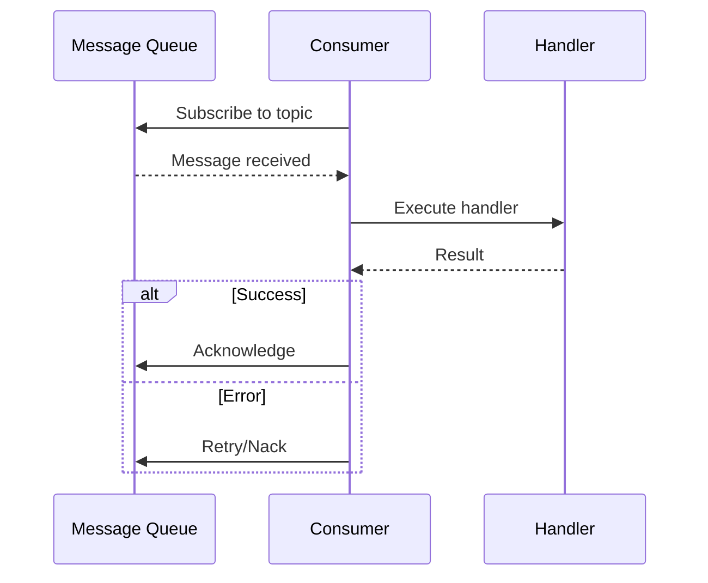
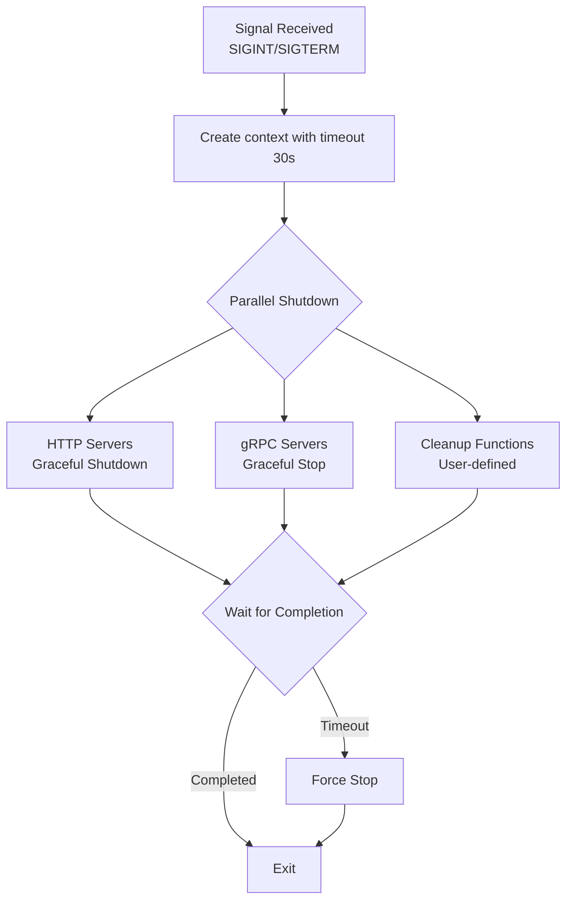
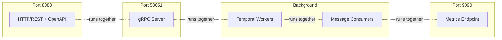
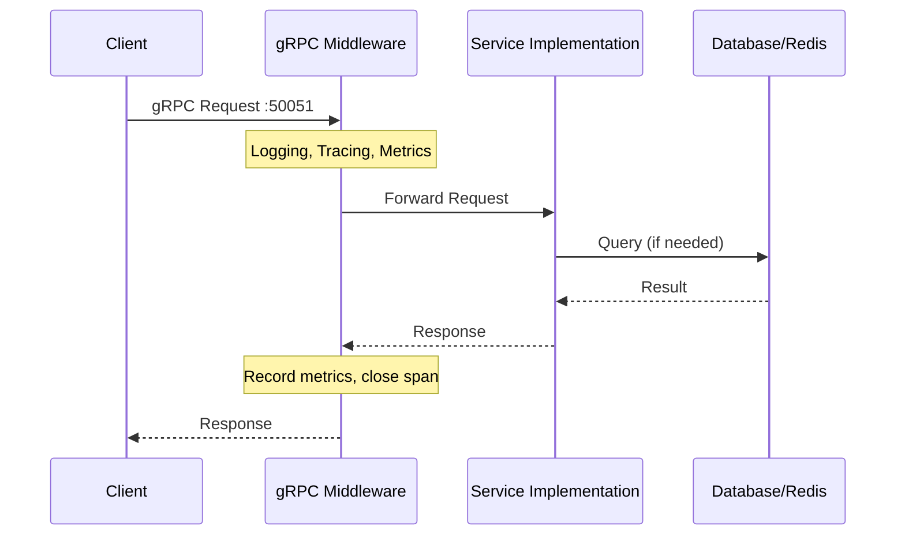
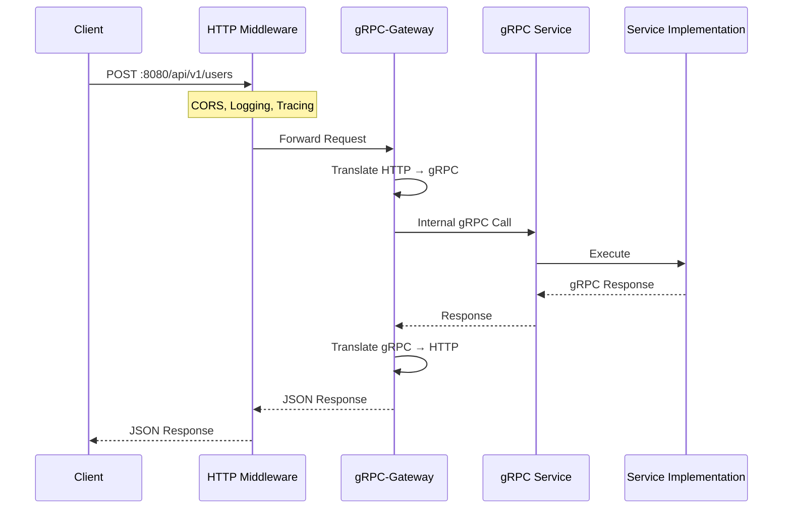
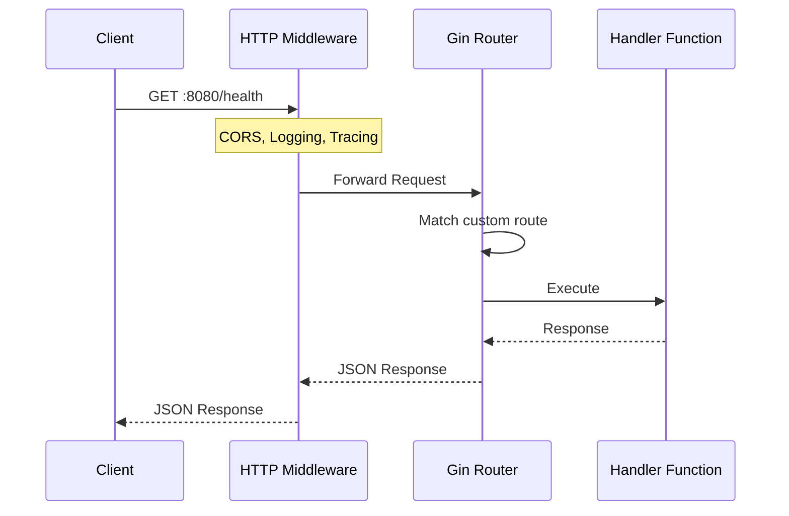
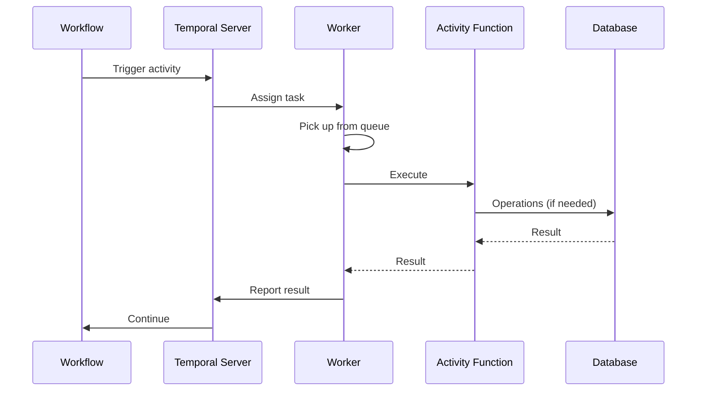
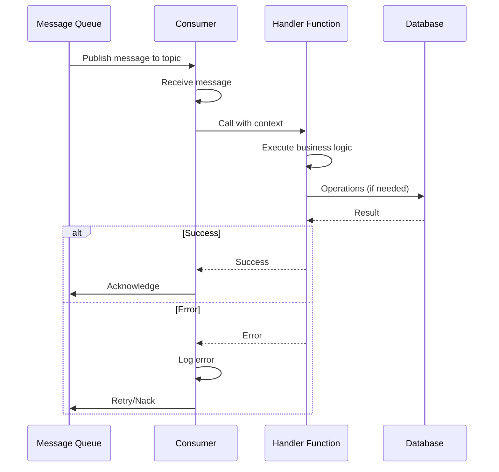

# Tonica Architecture Overview

This document explains the internal architecture and design principles of the Tonica framework.

## Design Philosophy

Tonica is built on several core principles:

1. **Proto-First**: APIs are defined using Protocol Buffers, ensuring type safety and contract-first design
2. **Convention over Configuration**: Sensible defaults with escape hatches for customization
3. **Modular**: Use only what you need - run as a unified service or separate components
4. **Observable by Default**: Built-in metrics, tracing, and logging
5. **Production-Ready**: Graceful shutdown, health checks, and error handling out of the box

## High-Level Architecture



## Core Components

### 1. Application Core (`App`)

The `App` struct is the heart of Tonica. It manages the application lifecycle and coordinates all components.

**Responsibilities:**
- Initialize and configure all subsystems
- Manage component registry
- Coordinate graceful shutdown
- Provide access to shared resources (logger, metrics, etc.)

**Key Fields:**
```go
type App struct {
    Name           string
    cfg            *config.Config
    logger         *slog.Logger
    router         *gin.Engine      // HTTP router
    metricRouter   *gin.Engine      // Metrics endpoint
    metricsManager *metrics.Manager
    registry       *Registry
    shutdown       *Shutdown
    customRoutes   []RouteMetadata  // Custom route definitions
}
```

**Lifecycle:**
```
NewApp() → Configure() → RegisterComponents() → Run() → Shutdown()
```

### 2. Registry

The Registry is a central repository for all application components (services, workers, consumers).

**Purpose:**
- Store and retrieve services by name
- Store and retrieve workers by name
- Store and retrieve consumers by name
- Prevent duplicate registrations
- Enable discovery of components during startup

**Implementation:**
```go
type Registry struct {
    services  map[string]*Service
    workers   map[string]*Worker
    consumers map[string]*Consumer
    mu        sync.RWMutex  // Thread-safe access
}
```

**Thread Safety:**
All registry operations are protected by a read-write mutex, allowing safe concurrent access.

### 3. Service Layer

Services handle gRPC and REST API requests.

**Service Structure:**
```go
type Service struct {
    name       string
    grpcServer *grpc.Server
    db         *DB
    redis      *Redis
}
```

**Request Flow:**

```mermaid
sequenceDiagram
    participant Client
    participant gRPC Server<br/>(port 50051)
    participant Service Implementation
    participant gRPC-Gateway
    participant HTTP Router<br/>(port 8080)

    Client->>gRPC Server<br/>(port 50051): gRPC Request
    gRPC Server<br/>(port 50051)->>Service Implementation: Process
    Service Implementation-->>gRPC Server<br/>(port 50051): Response

    Note over gRPC-Gateway: If REST Request
    Client->>HTTP Router<br/>(port 8080): HTTP Request
    HTTP Router<br/>(port 8080)->>gRPC-Gateway: Route
    gRPC-Gateway->>Service Implementation: Convert to gRPC
    Service Implementation-->>gRPC-Gateway: gRPC Response
    gRPC-Gateway-->>HTTP Router<br/>(port 8080): Convert to HTTP
    HTTP Router<br/>(port 8080)-->>Client: HTTP Response
```

**Features:**
- Automatic REST API generation via gRPC-Gateway
- OpenAPI spec generation from proto annotations
- Built-in middleware (CORS, logging, metrics)
- Custom route support

### 4. Worker Layer

Workers process background tasks using Temporal.

**Worker Structure:**
```go
type Worker struct {
    name        string
    taskQueue   string
    client      client.Client
    worker      worker.Worker
}
```

**Execution Flow:**



**Features:**
- Activity registration
- Workflow registration
- Automatic retries and error handling
- Distributed tracing integration

### 5. Consumer Layer

Consumers process messages from Kafka, PubSub, or other message queues.

**Consumer Structure:**
```go
type Consumer struct {
    name          string
    topic         string
    consumerGroup string
    client        storage.Client
    handler       func(context.Context, *pubsub.Message) error
}
```

**Processing Flow:**



**Features:**
- Context-based cancellation
- Automatic error handling and logging
- Graceful shutdown (waits for message completion)
- Consumer group support

### 6. Infrastructure Layer

#### Database (Bun ORM)

Tonica uses [Bun](https://bun.uptrace.dev/) as its ORM, supporting PostgreSQL, MySQL, and SQLite.

**Connection Management:**
```go
type DB struct {
    driver string
    dsn    string
    db     *bun.DB  // Cached connection
}

func (d *DB) GetClient() *bun.DB {
    if d.db != nil {
        return d.db  // Return cached connection
    }
    // Create new connection
    // ...
}
```

**Features:**
- Connection pooling
- Automatic driver detection
- Migration support (via Bun)
- Query builder

#### Redis

Redis client wrapper with connection caching.

**Connection Management:**
```go
type Redis struct {
    addr     string
    password string
    database int
    conn     *redis.Client  // Cached connection
}

func (r *Redis) GetClient() *redis.Client {
    if r.conn == nil {
        r.conn = redis.NewClient(&redis.Options{
            Addr:     r.addr,
            Password: r.password,
            DB:       r.database,
        })
    }
    return r.conn
}
```

**Use Cases:**
- Caching
- Session storage
- Rate limiting
- Distributed locking

### 7. Observability Layer

#### OpenTelemetry Tracing

Automatic distributed tracing for all requests.

**Instrumentation Points:**
- HTTP requests (incoming/outgoing)
- gRPC calls (incoming/outgoing)
- Database queries
- Redis operations
- Custom spans (user-defined)

**Configuration:**
```bash
OTEL_ENABLED=true
OTEL_ENDPOINT=localhost:4317
OTEL_SERVICE_NAME=myservice
```

#### Prometheus Metrics

Built-in metrics collection and export.

**Default Metrics:**
- `app_info` - Application metadata
- HTTP request metrics (duration, count, status)
- gRPC request metrics
- Go runtime metrics (goroutines, memory, GC)

**Custom Metrics:**
```go
counter := app.GetMetricManager().NewCounter("orders_total", "Total orders")
gauge := app.GetMetricManager().NewGauge("active_connections", "Active connections")
histogram := app.GetMetricManager().NewHistogram("request_duration", "Request duration")
```

**Metrics Endpoint:**
```
http://localhost:9090/metrics
```

#### Structured Logging

Uses Go's standard `log/slog` for structured logging.

**Log Levels:**
- `DEBUG` - Detailed debugging information
- `INFO` - General informational messages
- `WARN` - Warning messages
- `ERROR` - Error messages

**Usage:**
```go
logger := app.GetLogger()
logger.Info("User created", "user_id", userID, "email", email)
logger.Error("Failed to process order", "order_id", orderID, "error", err)
```

### 8. Shutdown Coordinator

The Shutdown coordinator ensures graceful termination of all components.

**Shutdown Flow:**



**Registration:**
```go
// Register HTTP server
app.shutdown.RegisterHTTPServer(httpServer)

// Register gRPC server
app.shutdown.RegisterGRPCServer(grpcServer)

// Register cleanup function
app.shutdown.RegisterCleanup(func(ctx context.Context) error {
    // Close database connections, flush metrics, etc.
    return db.Close()
})
```

**Features:**
- Parallel shutdown (fast)
- Timeout protection (no hanging)
- Error aggregation
- Thread-safe registration

## Run Modes

Tonica supports four run modes, each activating different components:

### ModeAio (All-In-One)
Runs everything: gRPC + REST + Workers + Consumers



### ModeService
Runs only gRPC and REST APIs

### ModeWorker
Runs only Temporal workers (+ metrics)

### ModeConsumer
Runs only message consumers (+ metrics)

See [Run Modes](./run-modes.md) for detailed comparison.

## Request Flow Examples

### gRPC Request



### REST Request (Generated from Proto)



### REST Request (Custom Route)



### Worker Task Processing



### Consumer Message Processing



## Configuration Management

Configuration follows this priority order (highest to lowest):

1. **Code** - Options passed to constructors
2. **Environment Variables** - `APP_NAME`, `DB_DSN`, etc.
3. **Defaults** - Built-in sensible defaults

Example:
```go
// 1. Code (highest priority)
app := tonica.NewApp(tonica.WithName("myservice"))

// 2. Environment variable
// export APP_NAME="envservice"

// 3. Default (lowest priority)
// Falls back to "tonica-app" if nothing specified
```

See [Configuration](./configuration.md) for all options.

## Error Handling Strategy

Tonica uses a layered error handling approach:

### Layer 1: Application Errors
```go
if err != nil {
    return nil, status.Error(codes.InvalidArgument, "invalid user ID")
}
```

### Layer 2: Middleware Errors
Automatically handled by framework:
- HTTP 500 for internal errors
- HTTP 4xx for client errors
- Logged with context

### Layer 3: Infrastructure Errors
Database, Redis, etc.:
```go
user, err := db.GetUser(ctx, userID)
if err != nil {
    logger.Error("Failed to get user", "error", err, "user_id", userID)
    return nil, status.Error(codes.Internal, "database error")
}
```

### Layer 4: Panic Recovery
Automatic panic recovery in HTTP/gRPC handlers:
- Logs panic with stack trace
- Returns 500 error to client
- Doesn't crash the application

## Concurrency Model

### Thread Safety Guarantees

**App**:
- Safe to call getters concurrently
- Registry access is mutex-protected
- Metrics manager is thread-safe

**Registry**:
- All operations use RWMutex
- Multiple readers allowed
- Exclusive writer lock

**Services/Workers/Consumers**:
- Each request/task/message in separate goroutine
- No shared mutable state (unless explicitly designed)
- Context-based cancellation

### Goroutine Management

**HTTP Server**:
- One goroutine per request
- Automatically cleaned up after response

**gRPC Server**:
- One goroutine per stream
- Cleaned up when stream closes

**Workers**:
- Configurable number of concurrent activities
- Managed by Temporal worker

**Consumers**:
- One goroutine per consumer
- Message processing can be sequential or parallel (user choice)

## Performance Considerations

### Connection Pooling

**Database**:
```go
// Bun handles connection pooling internally
db.SetMaxOpenConns(25)
db.SetMaxIdleConns(10)
db.SetConnMaxLifetime(5 * time.Minute)
```

**Redis**:
```go
// Redis client has built-in connection pool
// Configured via redis.Options
&redis.Options{
    PoolSize:     10,
    MinIdleConns: 5,
}
```

### Caching Strategy

1. **Application-level** - In-memory caches in your code
2. **Redis** - Distributed cache for multi-instance deployments
3. **Database** - Query result caching via Bun

### Metrics Overhead

Metrics collection is lightweight:
- Counter increment: ~100ns
- Histogram observation: ~500ns
- Negligible impact on performance

## Security Considerations

### Authentication & Authorization

Not built-in - implement as middleware:

```go
func AuthMiddleware() gin.HandlerFunc {
    return func(c *gin.Context) {
        token := c.GetHeader("Authorization")
        if !validateToken(token) {
            c.AbortWithStatus(401)
            return
        }
        c.Next()
    }
}

app.GetRouter().Use(AuthMiddleware())
```

### CORS

Built-in CORS support:
```bash
# Allow all origins (default)
# No configuration needed

# Restrict origins
export APP_CORS_ORIGINS="https://myapp.com,https://api.myapp.com"
```

### TLS/HTTPS

Configure at deployment level:
- Use reverse proxy (nginx, Traefik) with TLS termination
- Or configure TLS in Gin router directly

## Extending Tonica

### Custom Middleware

**HTTP Middleware**:
```go
app.GetRouter().Use(MyCustomMiddleware())
```

**gRPC Interceptors**:
```go
grpcServer := grpc.NewServer(
    grpc.UnaryInterceptor(MyInterceptor),
)
```

### Custom Metrics

```go
myCounter := app.GetMetricManager().NewCounter("my_metric", "Description")
myCounter.Inc()
```

### Custom Health Checks

```go
tonica.NewRoute(app).
    GET("/health/detailed").
    Handle(func(c *gin.Context) {
        health := map[string]string{
            "database": checkDB(),
            "redis":    checkRedis(),
            "workers":  checkWorkers(),
        }
        c.JSON(200, health)
    })
```

## Next Steps

- [Run Modes](./run-modes.md) - Learn when to use each mode
- [Configuration](./configuration.md) - Configure your application
- [Testing](./testing.md) - Write tests for your services
- [Best Practices](./best-practices.md) - Production patterns

## Further Reading

- [Protocol Buffers](https://protobuf.dev/)
- [gRPC](https://grpc.io/)
- [gRPC-Gateway](https://grpc-ecosystem.github.io/grpc-gateway/)
- [Temporal](https://temporal.io/)
- [Bun ORM](https://bun.uptrace.dev/)
- [OpenTelemetry](https://opentelemetry.io/)
