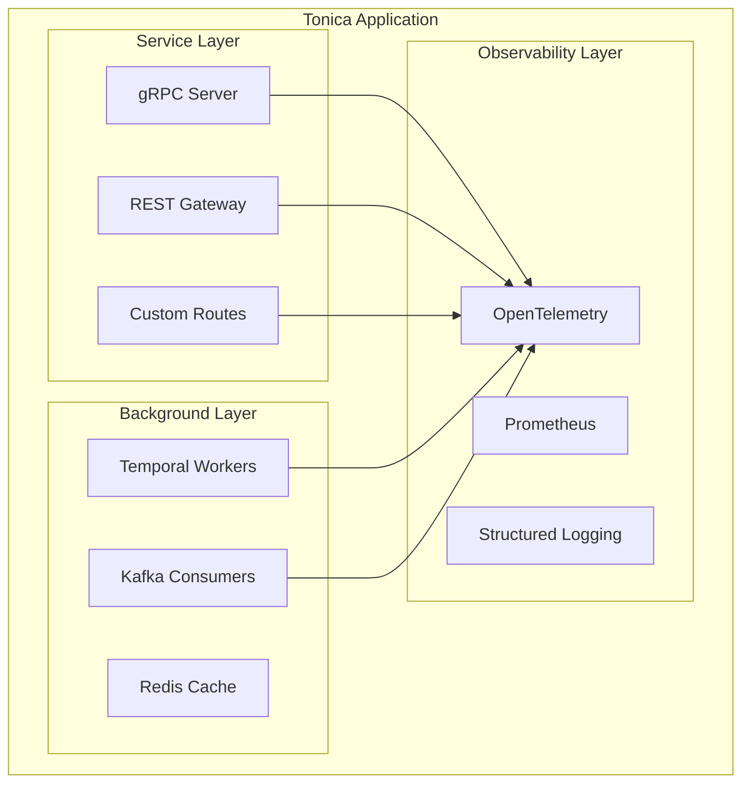

# Tonica Framework Documentation

Welcome to the Tonica framework documentation! Tonica is a modern, proto-first Go framework designed for building production-ready microservices with gRPC, REST APIs, workers, and message consumers.

## Table of Contents

### Core Documentation

1. [**Getting Started**](./getting-started.md) - Quick setup and your first Tonica application
2. [**CLI Reference**](./cli.md) - Tonica command-line tools and code generation
3. [**Architecture Overview**](./architecture.md) - Understanding how Tonica works
4. [**Run Modes**](./run-modes.md) - AIO, Service, Worker, Consumer, and Gateway modes explained
5. [**Configuration**](./configuration.md) - All configuration options and environment variables
6. [**Custom Routes**](./custom-routes.md) - Adding custom HTTP routes with OpenAPI documentation
7. [**Testing Guide**](./testing.md) - How to test your Tonica applications
8. [**Best Practices**](./best-practices.md) - Patterns, anti-patterns, and recommendations

### Additional Resources

- [API Reference](./api-reference.md) - Complete API documentation
- [Examples](../example/README.md) - Working example applications
- [Migration Guide](./migration.md) - Migrating from other frameworks

## Quick Links

### For New Users
Start with [Getting Started](./getting-started.md) to build your first application in 5 minutes.

### For Experienced Users
- [Run Modes](./run-modes.md) - Choose the right mode for your use case
- [Configuration](./configuration.md) - Fine-tune your application
- [Best Practices](./best-practices.md) - Production-ready patterns

## What is Tonica?

Tonica is a comprehensive Go framework that provides:

- **Proto-First Design**: Define your APIs with Protocol Buffers
- **Auto-Generated OpenAPI**: Swagger specs generated from your protos
- **Multiple Run Modes**: Run as unified service (AIO), standalone service, worker, or consumer
- **Built-in Observability**: OpenTelemetry tracing, Prometheus metrics, structured logging
- **Graceful Shutdown**: Proper lifecycle management for all components
- **Database Support**: PostgreSQL, MySQL, SQLite with Bun ORM
- **Redis Support**: Connection pooling and caching
- **Temporal Integration**: Built-in Temporal worker support
- **Message Consumers**: Kafka/PubSub consumer support
- **API Documentation UI**: Built-in Scalar UI for interactive API exploration

## Key Features

### 🚀 Proto-First Development
```protobuf
service UserService {
  rpc GetUser(GetUserRequest) returns (GetUserResponse) {
    option (google.api.http) = {
      get: "/api/v1/users/{id}"
    };
  }
}
```

### 🎯 Flexible Run Modes
```go
// All-in-one mode: gRPC + REST + Workers + Consumers
app.Run(context.Background(), tonica.ModeAio)

// Service only: gRPC + REST
app.Run(context.Background(), tonica.ModeService)

// Workers only: Temporal workers
app.Run(context.Background(), tonica.ModeWorker)

// Consumers only: Message consumers
app.Run(context.Background(), tonica.ModeConsumer)
```

### 🔌 Custom Routes
```go
tonica.NewRoute(app).
    GET("/health").
    Summary("Health check endpoint").
    Tags("Monitoring").
    Response(200, "Healthy", tonica.InlineObjectSchema(map[string]string{
        "status": "string",
    })).
    Handle(func(c *gin.Context) {
        c.JSON(200, gin.H{"status": "healthy"})
    })
```

### 📊 Built-in Observability
```go
import "log/slog"

// Metrics
app.GetMetricManager().NewCounter("requests_total", "Total requests")

// Tracing (automatic)
// Logging (structured with slog)
app.GetLogger().Info("Processing request", "user_id", userID)
// GetLogger() returns *slog.Logger
```

## Architecture

Tonica follows a modular architecture:



## Community and Support

- **Issues**: [GitHub Issues](https://github.com/tonica-go/tonica/issues)
- **Discussions**: [GitHub Discussions](https://github.com/tonica-go/tonica/discussions)
- **Examples**: See the [example directory](../example/)

## License

[Your License Here]

## Contributing

Contributions are welcome! Please read our [Contributing Guide](./CONTRIBUTING.md) for details.
