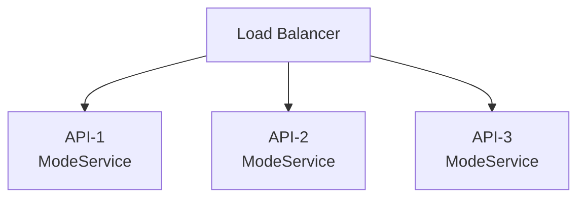
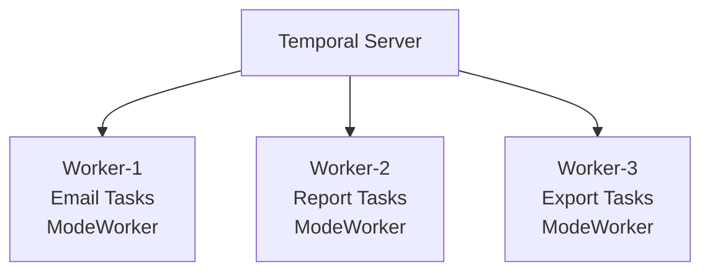
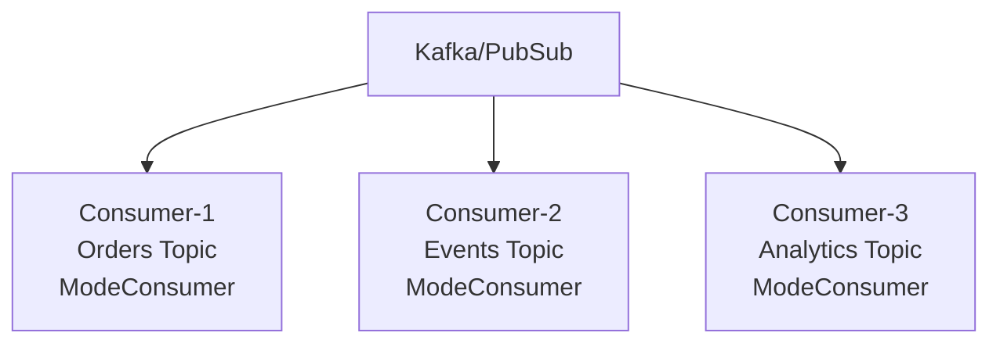
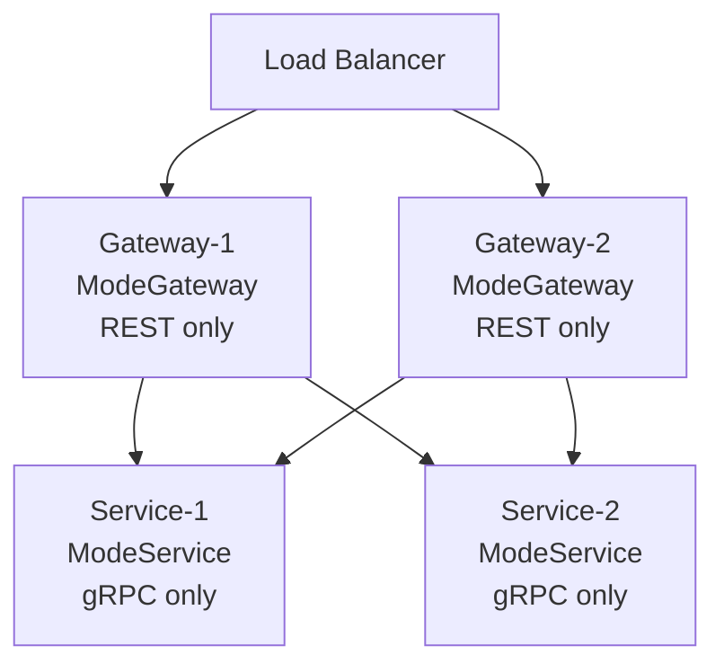
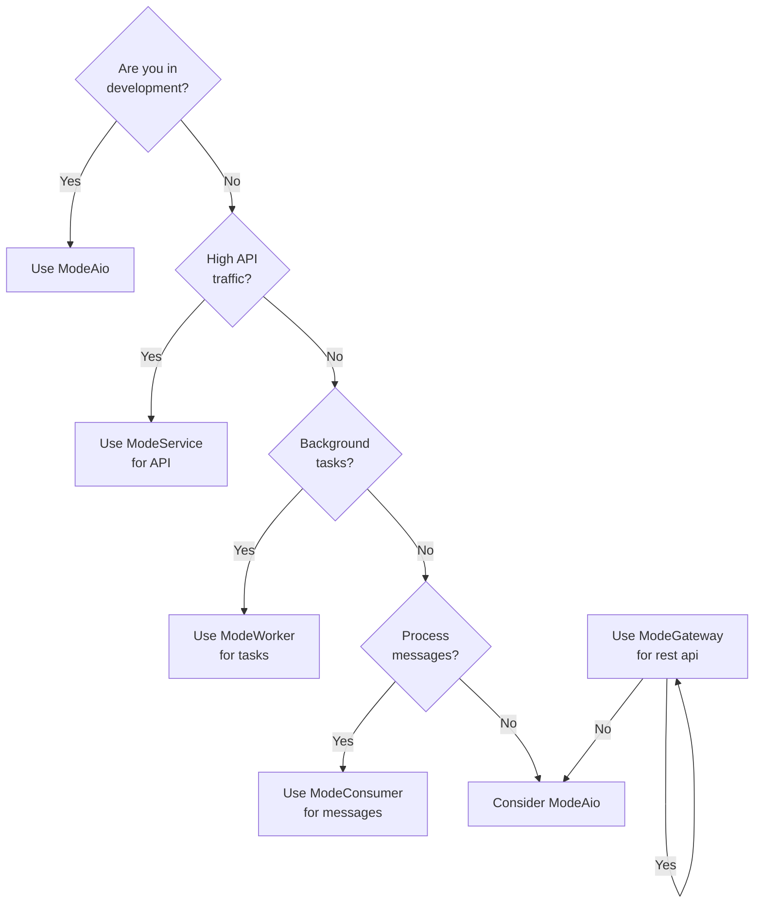

# Tonica Run Modes

Tonica supports four different run modes, allowing you to deploy your application as a unified service or split into
specialized components. This flexibility enables better resource utilization and scaling strategies.

## Available Run Modes

| Mode                 | Components                                 | Ports             | Use Case                       |
|----------------------|--------------------------------------------|-------------------|--------------------------------|
| **AIO** (All-In-One) | gRPC + REST + Workers + Consumers, Metrics | 8080, 50051, 2121 | Development, small deployments |
| **Service**          | gRPC, Metrics                              | 50051, 2121       | Grpc layer scaling             |
| **Worker**           | Temporal workers, Metrics                  | 2121              | Background task scaling        |
| **Consumer**         | Message consumers, Metrics                 | 2121              | Message processing scaling     |
| **Gateway**          | REST, Metrics                              | 8080, 2121        | Api layer scaling              |

## Mode Details

### ModeAio (All-In-One)

**Description**: Runs all components in a single process.

**What Starts:**

- HTTP/REST server (port 8080)
- gRPC server (port 50051)
- Temporal workers
- Message consumers
- Metrics endpoint (port 2121)
- OpenAPI documentation UI

**Example:**

```go
app := tonica.NewApp(
tonica.WithName("myservice"),
)

// Register services
svc := tonica.NewService(...)
app.GetRegistry().MustRegisterService(svc)

// Register workers
worker := tonica.NewWorker(...)
app.GetRegistry().MustRegisterWorker("my-worker", worker)

// Register consumers
consumer := tonica.NewConsumer(...)
app.GetRegistry().MustRegisterConsumer(consumer)

// Run in AIO mode
err := app.Run(context.Background(), tonica.ModeAio)
```

**When to Use:**

- ✅ Development environment
- ✅ Small applications with low traffic
- ✅ Proof of concepts
- ✅ Single-server deployments
- ✅ When operational simplicity is more important than scaling

**When NOT to Use:**

- ❌ High-traffic production (CPU/memory contention)
- ❌ Need to scale components independently
- ❌ CPU-intensive workers affecting API latency
- ❌ Large-scale message processing

**Resource Requirements:**

```yaml
# Example Kubernetes resources
resources:
  requests:
    cpu: "1000m"      # All components combined
    memory: "1Gi"
  limits:
    cpu: "2000m"
    memory: "2Gi"
```

---

### ModeService

**Description**: Runs only the API layer (gRPC and REST).

**What Starts:**

- gRPC server (port 50051)
- Metrics endpoint (port 2121)

**What Does NOT Start:**

- Temporal workers
- Message consumers

**Example:**

```go
app := tonica.NewApp(
tonica.WithName("myservice-api"),
)

// Register services ONLY
svc := tonica.NewService(...)
app.GetRegistry().MustRegisterService(svc)

// DON'T register workers or consumers in this mode

// Run in Service mode
err := app.Run(context.Background(), tonica.ModeService)
```

**When to Use:**

- ✅ Production API deployments
- ✅ Need to scale API independently from workers
- ✅ High request throughput
- ✅ Low-latency requirements
- ✅ Horizontal scaling of API layer

**Architecture Pattern:**



**Scaling Example:**

```bash
# Kubernetes Deployment
apiVersion: apps/v1
kind: Deployment
metadata:
  name: myservice-api
spec:
  replicas: 5  # Scale API horizontally
  template:
    spec:
      containers:
      - name: api
        image: myservice:latest
        env:
        - name: RUN_MODE
          value: "service"
        resources:
          requests:
            cpu: "500m"
            memory: "512Mi"
```

**Resource Requirements:**

```yaml
# Lighter than AIO - no workers/consumers
resources:
  requests:
    cpu: "500m"       # Just API handling
    memory: "512Mi"
  limits:
    cpu: "1000m"
    memory: "1Gi"
```

---

### ModeWorker

**Description**: Runs only Temporal workers for background task processing.

**What Starts:**

- Temporal workers
- Metrics endpoint (port 2121)

**What Does NOT Start:**

- HTTP/REST server
- gRPC server
- Message consumers

**Example:**

```go
app := tonica.NewApp(
tonica.WithName("myservice-worker"),
)

// Register workers ONLY
worker := tonica.NewWorker(
tonica.WithWorkerName("email-worker"),
tonica.WithTaskQueue("email-tasks"),
tonica.WithMaxConcurrentActivities(10),
)

// Register activities
worker.GetWorker().RegisterActivity(SendEmailActivity)
worker.GetWorker().RegisterActivity(GenerateReportActivity)

app.GetRegistry().MustRegisterWorker("email-worker", worker)

// Run in Worker mode
err := app.Run(context.Background(), tonica.ModeWorker)
```

**When to Use:**

- ✅ CPU-intensive background tasks
- ✅ Long-running operations (reports, exports)
- ✅ Batch processing
- ✅ Need to scale workers independently
- ✅ Task-specific resource requirements

**Architecture Pattern:**



**Specialized Workers:**

```go
// Email worker - high concurrency, low CPU
emailWorker := tonica.NewWorker(
tonica.WithWorkerName("email-worker"),
tonica.WithTaskQueue("emails"),
tonica.WithMaxConcurrentActivities(50), // Many concurrent emails
)

// Report worker - low concurrency, high CPU
reportWorker := tonica.NewWorker(
tonica.WithWorkerName("report-worker"),
tonica.WithTaskQueue("reports"),
tonica.WithMaxConcurrentActivities(2), // CPU-intensive reports
)
```

**Resource Requirements:**

```yaml
# Email worker (I/O bound)
resources:
  requests:
    cpu: "200m"
    memory: "256Mi"
  limits:
    cpu: "500m"
    memory: "512Mi"

---

# Report worker (CPU bound)
resources:
  requests:
    cpu: "2000m"      # Needs more CPU
    memory: "2Gi"
  limits:
    cpu: "4000m"
    memory: "4Gi"
```

---

### ModeConsumer

**Description**: Runs only message consumers for Kafka/PubSub processing.

**What Starts:**

- Message consumers
- Metrics endpoint (port 2121)

**What Does NOT Start:**

- HTTP/REST server
- gRPC server
- Temporal workers

**Example:**

```go
app := tonica.NewApp(
tonica.WithName("myservice-consumer"),
)

// Register consumers ONLY
orderConsumer := tonica.NewConsumer(
tonica.WithConsumerName("order-consumer"),
tonica.WithTopic("orders"),
tonica.WithConsumerGroup("order-processors"),
tonica.WithHandler(processOrder),
)

app.GetRegistry().MustRegisterConsumer(orderConsumer)

// Run in Consumer mode
err := app.Run(context.Background(), tonica.ModeConsumer)
```

**When to Use:**

- ✅ High-volume message processing
- ✅ Event-driven architectures
- ✅ Stream processing
- ✅ Need to scale consumers independently
- ✅ Topic-specific processing logic

**Architecture Pattern:**



**Multiple Consumers:**

```go
// Order consumer - high priority
orderConsumer := tonica.NewConsumer(
tonica.WithConsumerName("order-consumer"),
tonica.WithTopic("orders"),
tonica.WithConsumerGroup("order-processors"),
tonica.WithHandler(processOrder),
)

// Analytics consumer - low priority
analyticsConsumer := tonica.NewConsumer(
tonica.WithConsumerName("analytics-consumer"),
tonica.WithTopic("events"),
tonica.WithConsumerGroup("analytics"),
tonica.WithHandler(processAnalytics),
)

app.GetRegistry().MustRegisterConsumer(orderConsumer)
app.GetRegistry().MustRegisterConsumer(analyticsConsumer)
```

**Resource Requirements:**

```yaml
# Consumer resources depend on processing complexity
resources:
  requests:
    cpu: "500m"
    memory: "512Mi"
  limits:
    cpu: "1000m"
    memory: "1Gi"
```

---

### ModeGateway

**Description**: Runs only the HTTP/REST API gateway layer (without gRPC server).

**What Starts:**

- HTTP/REST server (port 8080)
- gRPC-Gateway (proxies REST requests to backend gRPC services)
- Custom routes
- OpenAPI documentation UI
- Metrics endpoint (port 2121)

**What Does NOT Start:**

- gRPC server (connects to external gRPC services instead)
- Temporal workers
- Message consumers

**Example:**

```go
app := tonica.NewApp(
    tonica.WithName("myservice-gateway"),
    tonica.WithSpec("openapi/spec.json"),
)

// Don't register services directly - gateway proxies to external gRPC servers
// Just configure custom routes if needed
tonica.NewRoute(app).
    GET("/health").
    Handle(func(c *gin.Context) {
        c.JSON(200, gin.H{"status": "healthy"})
    })

// Run in Gateway mode
err := app.Run(context.Background(), tonica.ModeGateway)
```

**When to Use:**

- ✅ Separate REST API layer from gRPC services
- ✅ Independent scaling of API gateway
- ✅ Edge layer for multiple backend services
- ✅ API rate limiting and caching at gateway level
- ✅ Public-facing REST API with private gRPC backends

**Architecture Pattern:**



**Use Case Example:**

```
┌─────────────┐
│   Clients   │ (Mobile, Web, etc.)
└──────┬──────┘
       │ HTTP/REST
       ↓
┌─────────────┐
│  Gateways   │ ModeGateway (scaled: 10 replicas)
│  Port 8080  │ - Rate limiting
└──────┬──────┘ - Caching
       │ gRPC   - Auth
       ↓
┌─────────────┐
│  Services   │ ModeService (scaled: 5 replicas)
│  Port 50051 │ - Business logic
└─────────────┘ - Database access
```

**Resource Requirements:**

```yaml
# Gateway is lightweight - just proxying
resources:
  requests:
    cpu: "200m"
    memory: "256Mi"
  limits:
    cpu: "500m"
    memory: "512Mi"
```

**Configuration:**

Point gateway to backend gRPC services:

```bash
# Service addresses
export USERSERVICE_ADDR="user-service:50051"
export ORDERSERVICE_ADDR="order-service:50051"
export PAYMENTSERVICE_ADDR="payment-service:50051"
```

## Choosing the Right Mode

### Decision Tree



### Deployment Patterns

#### Pattern 1: Development

```yaml
# Single container
services:
  app:
    image: myservice:latest
    environment:
      RUN_MODE: aio
    ports:
      - "8080:8080"   # HTTP
      - "50051:50051" # gRPC
      - "9090:9090"   # Metrics
```

#### Pattern 2: Small Production

```yaml
# Separate API and workers
services:
  gateway:
    image: myservice:latest
    environment:
      RUN_MODE: gateway
    replicas: 3
    ports:
      - "8080:8080"

  api:
    image: myservice:latest
    environment:
      RUN_MODE: service
    replicas: 3
    ports:
      - "8080:8080"
      - "50051:50051"

  worker:
    image: myservice:latest
    environment:
      RUN_MODE: worker
    replicas: 2
```

#### Pattern 3: Large Production

```yaml
# Fully separated components
services:
  gateway:
    image: myservice:latest
    environment:
      RUN_MODE: gateway
    replicas: 10       # Scale API independently

  api:
    image: myservice:latest
    environment:
      RUN_MODE: service
    replicas: 10       # Scale API independently

  email-worker:
    image: myservice:latest
    environment:
      RUN_MODE: worker
      WORKER_TASK_QUEUE: emails
    replicas: 5

  report-worker:
    image: myservice:latest
    environment:
      RUN_MODE: worker
      WORKER_TASK_QUEUE: reports
    replicas: 2
    resources:
      cpu: "4000m"     # More CPU for reports

  order-consumer:
    image: myservice:latest
    environment:
      RUN_MODE: consumer
      CONSUMER_TOPIC: orders
    replicas: 3
```

## Mode Configuration

### Via Environment Variable

```bash
# Set run mode via environment
export RUN_MODE="service"

# In your code, read from environment
mode := os.Getenv("RUN_MODE")
if mode == "" {
    mode = "aio"  # Default
}

app.Run(context.Background(), tonica.Mode(mode))
```

### Via Code

```go
// Hardcode the mode
app.Run(context.Background(), tonica.ModeService)
```

### Via Command Line Flag

```go
func main() {
mode := flag.String("mode", "aio", "Run mode: aio, service, worker, consumer, gateway")
flag.Parse()

app := tonica.NewApp()
app.Run(context.Background(), tonica.Mode(*mode))
}
```

## Graceful Shutdown in All Modes

All modes support graceful shutdown:

```go
ctx, cancel := signal.NotifyContext(context.Background(), os.Interrupt, syscall.SIGTERM)
defer cancel()

err := app.Run(ctx, tonica.ModeAio)
```

**Shutdown Behavior by Mode:**

| Mode         | Shutdown Process                                                                                                                                                                    |
|--------------|-------------------------------------------------------------------------------------------------------------------------------------------------------------------------------------|
| **AIO**      | 1. Stop accepting new HTTP/gRPC requests<br/>2. Wait for in-flight requests (30s)<br/>3. Stop workers<br/>4. Wait for consumers to finish current message (5s)<br/>5. Close connections |
| **Service**  | 1. Stop accepting new requests<br/>2. Wait for in-flight requests (30s)<br/>3. Close connections                                                                                      |
| **Worker**   | 1. Stop accepting new tasks<br/>2. Wait for current tasks to complete<br/>3. Close Temporal connection                                                                                |
| **Consumer** | 1. Stop accepting new messages<br/>2. Wait for current message processing (5s)<br/>3. Close message queue connection                                                                  |
| **Gateway**  | 1. Stop accepting new HTTP requests                                                                                                                                                 |

## Monitoring Each Mode

### Metrics by Mode

All modes expose metrics on port 2121:

```bash
curl http://localhost:2121/metrics
```

**Mode-Specific Metrics:**

**ModeService:**

- `http_requests_total`
- `http_request_duration_seconds`
- `grpc_requests_total`
- `grpc_request_duration_seconds`

**ModeWorker:**

- `temporal_activity_execution_total`
- `temporal_activity_duration_seconds`
- `temporal_activity_errors_total`

**ModeConsumer:**

- `consumer_messages_processed_total`
- `consumer_messages_failed_total`
- `consumer_processing_duration_seconds`

### Health Checks

Add mode-specific health checks:

```go
tonica.NewRoute(app).
GET("/health").
Handle(func (c *gin.Context) {
health := gin.H{
"status": "healthy",
"mode":   "service", // or worker, consumer
}

// Add mode-specific checks
if mode == "worker" {
health["workers"] = len(app.GetRegistry().GetAllWorkers())
}

c.JSON(200, health)
})
```

## Common Pitfalls

### ❌ Registering Wrong Components

```go
// DON'T: Register workers in Service mode
app := tonica.NewApp()
worker := tonica.NewWorker(...)
app.GetRegistry().MustRegisterWorker("worker", worker)
app.Run(ctx, tonica.ModeService) // Worker won't start!
```

### ✅ Register Appropriate Components

```go
// DO: Only register services in Service mode
app := tonica.NewApp()
svc := tonica.NewService(...)
app.GetRegistry().MustRegisterService(svc)
app.Run(ctx, tonica.ModeService) // Correct!
```

### ❌ Port Conflicts

```go
// DON'T: Run multiple Service mode instances on same host
// Both try to bind to port 8080 and 50051
```

### ✅ Use Different Hosts or Containers

```yaml
# DO: Run in separate containers/hosts
services:
  api-1:
    ports: [ "8080:8080" ]
  api-2:
    ports: [ "8081:8080" ]  # Map to different external port
```

## Advanced: Dynamic Mode Selection

```go
func main() {
mode := os.Getenv("RUN_MODE")

app := tonica.NewApp()

// Register all components
svc := tonica.NewService(...)
worker := tonica.NewWorker(...)
consumer := tonica.NewConsumer(...)

// Register based on mode
switch mode {
case "service":
app.GetRegistry().MustRegisterService(svc)
case "worker":
app.GetRegistry().MustRegisterWorker("worker", worker)
case "consumer":
app.GetRegistry().MustRegisterConsumer(consumer)
default: // "aio"
app.GetRegistry().MustRegisterService(svc)
app.GetRegistry().MustRegisterWorker("worker", worker)
app.GetRegistry().MustRegisterConsumer(consumer)
}

app.Run(context.Background(), tonica.Mode(mode))
}
```

## Summary

| Mode         | Development | Production    | Scaling                 | Resource Efficiency |
|--------------|-------------|---------------|-------------------------|---------------------|
| **AIO**      | ✅ Perfect   | ⚠️ Small only | ❌ Limited               | ⚠️ Medium           |
| **Service**  | ✅ Good      | ✅ Excellent   | ✅ Horizontal            | ✅ High              |
| **Worker**   | ✅ Good      | ✅ Excellent   | ✅ Horizontal + Vertical | ✅ High              |
| **Consumer** | ✅ Good      | ✅ Excellent   | ✅ Horizontal            | ✅ High              |
| **Gateway**  | ✅ Good      | ✅ Excellent   | ✅ Horizontal            | ✅ High              |

**Recommendation**: Start with **ModeAio** for development, then split into **ModeService** + **ModeWorker** + *
*ModeConsumer** for production.

## Next Steps

- [Configuration](./configuration.md) - Configure each mode
- [Best Practices](./best-practices.md) - Production deployment patterns
- [Testing](./testing.md) - Test each mode independently
