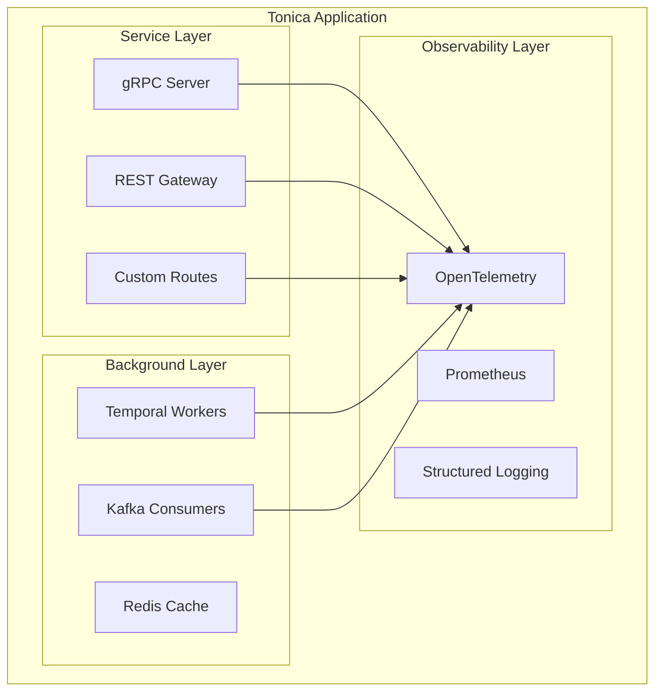

# Документация Tonica Framework

Добро пожаловать в документацию фреймворка Tonica! Tonica — это современный Go-фреймворк с proto-first подходом для создания production-ready микросервисов с gRPC, REST API, воркерами и message consumers.

## Оглавление

### Основная документация

1. [**Начало работы**](./getting-started.md) - Быстрая настройка и первое приложение на Tonica
2. [**Справочник CLI**](./cli.md) - Инструменты командной строки и генерация кода
3. [**Обзор архитектуры**](./architecture.md) - Как работает Tonica
4. [**Режимы запуска**](./run-modes.md) - AIO, Service, Worker, Consumer и Gateway режимы
5. [**Конфигурация**](./configuration.md) - Все параметры конфигурации и переменные окружения
6. [**Пользовательские роуты**](./custom-routes.md) - Добавление кастомных HTTP маршрутов с OpenAPI документацией
7. [**Руководство по тестированию**](./testing.md) - Как тестировать Tonica приложения
8. [**Лучшие практики**](./best-practices.md) - Паттерны, антипаттерны и рекомендации

### Дополнительные ресурсы

- [GitHub репозиторий](https://github.com/tonica-go/tonica) - Исходный код и примеры
- [Документация Go пакета](https://pkg.go.dev/github.com/tonica-go/tonica) - Полный API справочник
- [GitHub Discussions](https://github.com/tonica-go/tonica/discussions) - Поддержка сообщества

## Быстрые ссылки

### Для новых пользователей
Начните с [Начала работы](./getting-started.md), чтобы создать первое приложение за 5 минут.

### Для опытных пользователей
- [Режимы запуска](./run-modes.md) - Выберите правильный режим для вашего случая
- [Конфигурация](./configuration.md) - Тонкая настройка приложения
- [Лучшие практики](./best-practices.md) - Production-ready паттерны

## Что такое Tonica?

Tonica — это комплексный Go-фреймворк, который предоставляет:

- **Proto-First дизайн**: Определяйте API с помощью Protocol Buffers
- **Автогенерация OpenAPI**: Swagger спецификации генерируются из proto аннотаций
- **Множество режимов запуска**: Запускайте как единый сервис (AIO), standalone сервис, воркер или consumer
- **Встроенная наблюдаемость**: OpenTelemetry трейсинг, Prometheus метрики, структурированное логирование
- **Graceful Shutdown**: Правильное управление жизненным циклом всех компонентов
- **Поддержка БД**: PostgreSQL, MySQL, SQLite с Bun ORM
- **Поддержка Redis**: Connection pooling и кэширование
- **Интеграция Temporal**: Встроенная поддержка Temporal воркеров
- **Message Consumers**: Поддержка Kafka/PubSub consumers
- **UI для API документации**: Встроенный Scalar UI для интерактивного изучения API

## Ключевые возможности

### 🚀 Proto-First разработка
```protobuf
service UserService {
  rpc GetUser(GetUserRequest) returns (GetUserResponse) {
    option (google.api.http) = {
      get: "/api/v1/users/{id}"
    };
  }
}
```

### 🎯 Гибкие режимы запуска
```go
import (
    "github.com/tonica-go/tonica/pkg/tonica"
    "github.com/tonica-go/tonica/pkg/tonica/config"
)

// All-in-one mode: gRPC + REST + Workers + Consumers
app := tonica.NewApp(
    tonica.WithConfig(
        config.NewConfig(
            config.WithRunMode(config.ModeAIO),
        ),
    ),
)
err := app.Run()

// Service only: gRPC + REST
app := tonica.NewApp(
    tonica.WithConfig(
        config.NewConfig(
            config.WithRunMode(config.ModeService),
        ),
    ),
)
err := app.Run()

// Workers only: Temporal workers
app := tonica.NewApp(
    tonica.WithConfig(
        config.NewConfig(
            config.WithRunMode(config.ModeWorker),
        ),
    ),
)
err := app.Run()

// Consumers only: Message consumers
app := tonica.NewApp(
    tonica.WithConfig(
        config.NewConfig(
            config.WithRunMode(config.ModeConsumer),
        ),
    ),
)
err := app.Run()
```

### 🔌 Пользовательские маршруты
```go
tonica.NewRoute(app).
    GET("/health").
    Summary("Health check endpoint").
    Tags("Monitoring").
    Response(200, "Healthy", tonica.InlineObjectSchema(map[string]string{
        "status": "string",
    })).
    Handle(func(c *gin.Context) {
        c.JSON(200, gin.H{"status": "healthy"})
    })
```

### 📊 Встроенная наблюдаемость
```go
import "log/slog"

// Metrics
app.GetMetricManager().NewCounter("requests_total", "Total requests")

// Tracing (automatic)
// Logging (structured with slog)
app.GetLogger().Info("Processing request", "user_id", userID)
// GetLogger() returns *slog.Logger
```

## Архитектура

Tonica следует модульной архитектуре:



## Сообщество и поддержка

- **Проблемы**: [GitHub Issues](https://github.com/tonica-go/tonica/issues)
- **Обсуждения**: [GitHub Discussions](https://github.com/tonica-go/tonica/discussions)
- **Примеры**: [Примеры на GitHub](https://github.com/tonica-go/tonica/tree/main/example)

## Лицензия

[Ваша лицензия здесь]

## Вклад в проект

Мы приветствуем вклад в проект! Пожалуйста, посетите наш [GitHub репозиторий](https://github.com/tonica-go/tonica) для ознакомления с руководством по внесению вклада.
