# Обзор архитектуры Tonica

Этот документ объясняет внутреннюю архитектуру и принципы проектирования фреймворка Tonica.

## Философия дизайна

Tonica построен на нескольких основных принципах:

1. **Proto-First**: API определяются с использованием Protocol Buffers, обеспечивая типобезопасность и контрактный дизайн
2. **Соглашения вместо конфигурации**: Разумные значения по умолчанию с возможностями для настройки
3. **Модульность**: Используйте только то, что нужно - запускайте как единый сервис или отдельные компоненты
4. **Наблюдаемость по умолчанию**: Встроенные метрики, трассировка и логирование
5. **Готовность к production**: Корректное завершение, проверки работоспособности и обработка ошибок из коробки

## Высокоуровневая архитектура

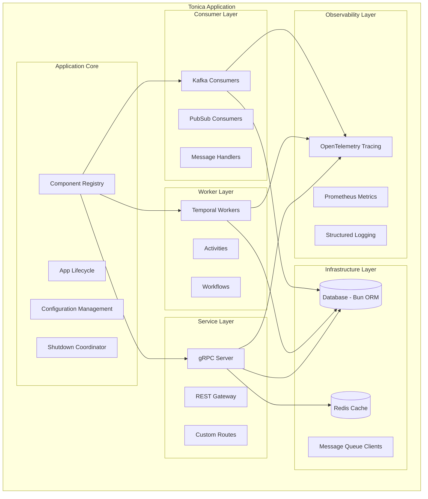

## Основные компоненты

### 1. Ядро приложения (`App`)

Структура `App` - это сердце Tonica. Она управляет жизненным циклом приложения и координирует все компоненты.

**Обязанности:**
- Инициализация и настройка всех подсистем
- Управление реестром компонентов
- Координация корректного завершения
- Предоставление доступа к общим ресурсам (логгер, метрики и т.д.)

**Ключевые поля:**
```go
type App struct {
    Name           string
    cfg            *config.Config
    logger         *log.Logger      // Standard logger
    router         *gin.Engine      // HTTP router
    metricRouter   *gin.Engine      // Metrics endpoint
    metricsManager *metrics.Manager
    registry       *Registry
    shutdown       *Shutdown
    customRoutes   []RouteMetadata  // Custom route definitions
}
```

**Жизненный цикл:**
```
NewApp() → Configure() → RegisterComponents() → Run() → Shutdown()
```

### 2. Реестр (Registry)

Реестр - это центральный репозиторий для всех компонентов приложения (сервисы, воркеры, консьюмеры).

**Назначение:**
- Сохранение и получение сервисов по имени
- Сохранение и получение воркеров по имени
- Сохранение и получение консьюмеров по имени
- Предотвращение дублирующихся регистраций
- Обеспечение обнаружения компонентов во время запуска

**Реализация:**
```go
type Registry struct {
    services  map[string]*Service
    workers   map[string]*Worker
    consumers map[string]*Consumer
    mu        sync.RWMutex  // Thread-safe access
}
```

**Потокобезопасность:**
Все операции реестра защищены мьютексом чтения-записи, что позволяет безопасный конкурентный доступ.

### 3. Слой сервисов

Сервисы обрабатывают gRPC и REST API запросы.

**Структура сервиса:**
```go
type Service struct {
    name       string
    grpcServer *grpc.Server
    db         *DB
    redis      *Redis
}
```

**Поток запросов:**

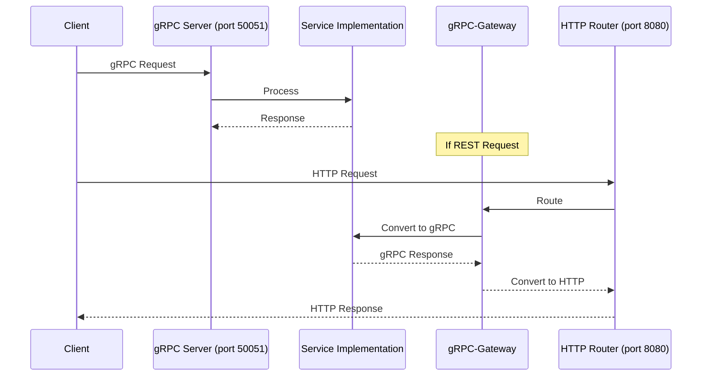

**Возможности:**
- Автоматическая генерация REST API через gRPC-Gateway
- Генерация OpenAPI спецификации из proto аннотаций
- Встроенный middleware (CORS, логирование, метрики)
- Поддержка пользовательских маршрутов

### 4. Слой воркеров

Воркеры обрабатывают фоновые задачи с использованием Temporal.

**Структура воркера:**
```go
type Worker struct {
    name        string
    taskQueue   string
    client      client.Client
    worker      worker.Worker
}
```

**Поток выполнения:**

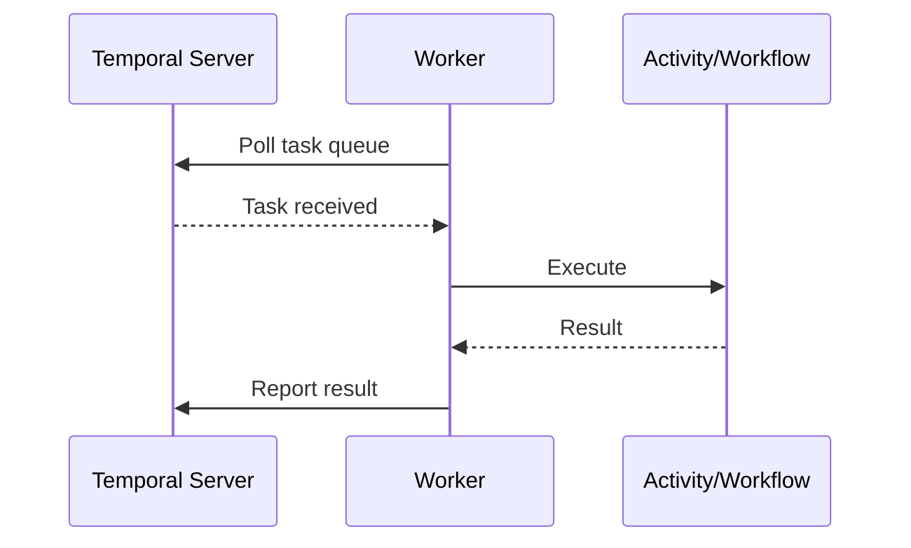

**Возможности:**
- Регистрация активностей
- Регистрация workflow
- Автоматические повторные попытки и обработка ошибок
- Интеграция распределенной трассировки

### 5. Слой консьюмеров

Консьюмеры обрабатывают сообщения из Kafka, PubSub или других очередей сообщений.

**Структура консьюмера:**
```go
type Consumer struct {
    name          string
    topic         string
    consumerGroup string
    client        storage.Client
    handler       func(context.Context, *pubsub.Message) error
}
```

**Поток обработки:**

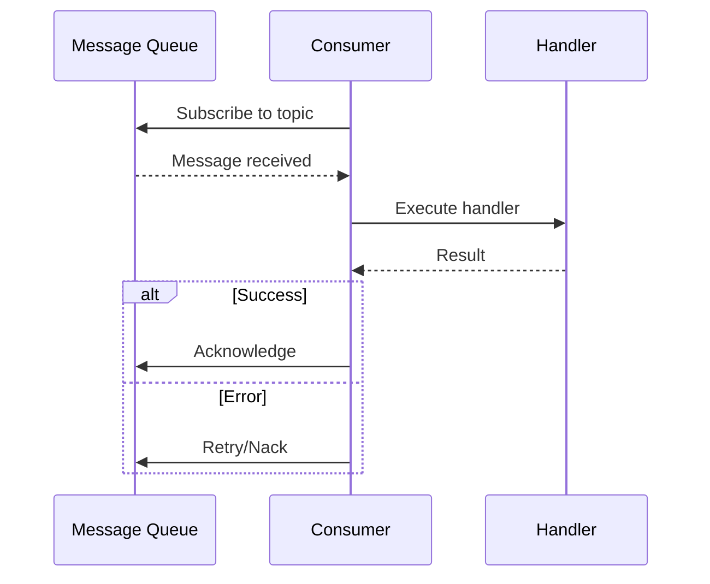

**Возможности:**
- Отмена на основе контекста
- Автоматическая обработка ошибок и логирование
- Корректное завершение (ожидает завершения обработки сообщения)
- Поддержка групп консьюмеров

### 6. Инфраструктурный слой

#### База данных (Bun ORM)

Tonica использует [Bun](https://bun.uptrace.dev/) в качестве ORM, поддерживая PostgreSQL, MySQL и SQLite.

**Управление соединениями:**
```go
type DB struct {
    driver string
    dsn    string
    db     *bun.DB  // Cached connection
}

func (d *DB) GetClient() *bun.DB {
    if d.db != nil {
        return d.db  // Return cached connection
    }
    // Create new connection
    // ...
}
```

**Возможности:**
- Пулинг соединений
- Автоматическое определение драйвера
- Поддержка миграций (через Bun)
- Построитель запросов

#### Redis

Обертка клиента Redis с кэшированием соединений.

**Управление соединениями:**
```go
type Redis struct {
    addr     string
    password string
    database int
    conn     *redis.Client  // Cached connection
}

func (r *Redis) GetClient() *redis.Client {
    if r.conn == nil {
        r.conn = redis.NewClient(&redis.Options{
            Addr:     r.addr,
            Password: r.password,
            DB:       r.database,
        })
    }
    return r.conn
}
```

**Варианты использования:**
- Кэширование
- Хранение сессий
- Ограничение скорости
- Распределенные блокировки

### 7. Слой наблюдаемости

#### Трассировка OpenTelemetry

Автоматическая распределенная трассировка для всех запросов.

**Точки инструментации:**
- HTTP запросы (входящие/исходящие)
- gRPC вызовы (входящие/исходящие)
- Запросы к базе данных
- Операции Redis
- Пользовательские span'ы (определяемые пользователем)

**Конфигурация:**
```bash
OTEL_ENABLED=true
OTEL_ENDPOINT=localhost:4317
OTEL_SERVICE_NAME=myservice
```

#### Метрики Prometheus

Встроенный сбор и экспорт метрик.

**Метрики по умолчанию:**
- `app_info` - Метаданные приложения
- Метрики HTTP запросов (длительность, количество, статус)
- Метрики gRPC запросов
- Метрики Go runtime (горутины, память, GC)

**Пользовательские метрики:**
```go
counter := app.GetMetricManager().NewCounter("orders_total", "Total orders")
gauge := app.GetMetricManager().NewGauge("active_connections", "Active connections")
histogram := app.GetMetricManager().NewHistogram("request_duration", "Request duration")
```

**Эндпоинт метрик:**
```
http://localhost:9090/metrics
```

#### Структурированное логирование

Использует стандартный `log/slog` Go для структурированного логирования.

**Уровни логов:**
- `DEBUG` - Детальная отладочная информация
- `INFO` - Общие информационные сообщения
- `WARN` - Предупреждающие сообщения
- `ERROR` - Сообщения об ошибках

**Использование:**
```go
import "log/slog"

// Use slog for structured logging
slog.Info("User created", "user_id", userID, "email", email)
slog.Error("Failed to process order", "order_id", orderID, "error", err)

// Or use app's logger (*log.Logger)
app.GetLogger().Printf("User created: %s", userID)
```

### 8. Координатор завершения

Координатор завершения обеспечивает корректное завершение работы всех компонентов.

**Поток завершения:**

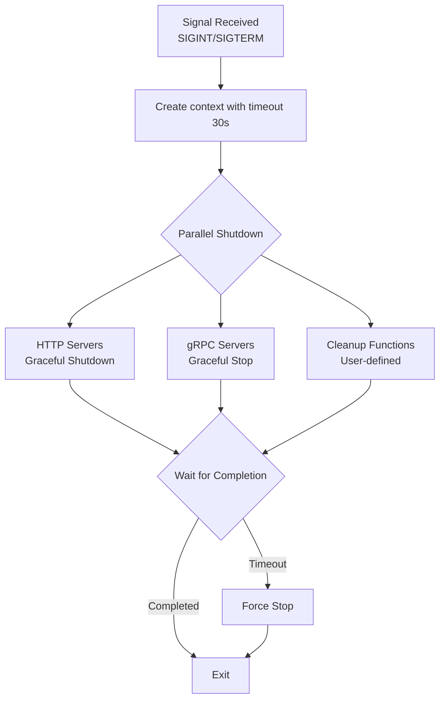

**Регистрация:**
```go
// Register HTTP server
app.shutdown.RegisterHTTPServer(httpServer)

// Register gRPC server
app.shutdown.RegisterGRPCServer(grpcServer)

// Register cleanup function
app.shutdown.RegisterCleanup(func(ctx context.Context) error {
    // Close database connections, flush metrics, etc.
    return db.Close()
})
```

**Возможности:**
- Параллельное завершение (быстро)
- Защита по таймауту (без зависаний)
- Агрегация ошибок
- Потокобезопасная регистрация

## Режимы запуска

Tonica поддерживает четыре режима запуска, каждый из которых активирует разные компоненты:

### ModeAio (Все-в-одном)
Запускает всё: gRPC + REST + Воркеры + Консьюмеры

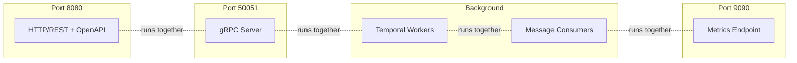

### ModeService
Запускает только gRPC и REST API

### ModeWorker
Запускает только Temporal воркеры (+ метрики)

### ModeConsumer
Запускает только консьюмеры сообщений (+ метрики)

См. [Режимы запуска](./run-modes.md) для детального сравнения.

## Примеры потоков запросов

### gRPC запрос

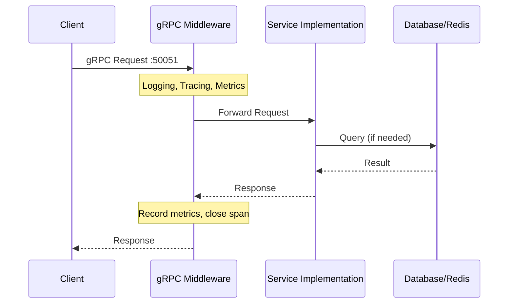

### REST запрос (сгенерированный из Proto)

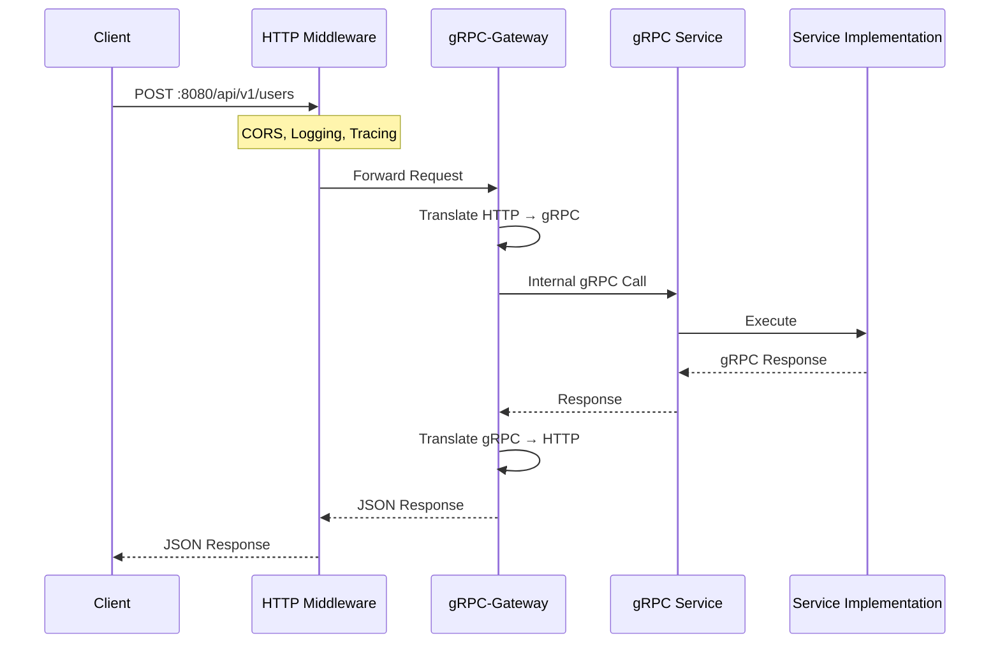

### REST запрос (пользовательский маршрут)

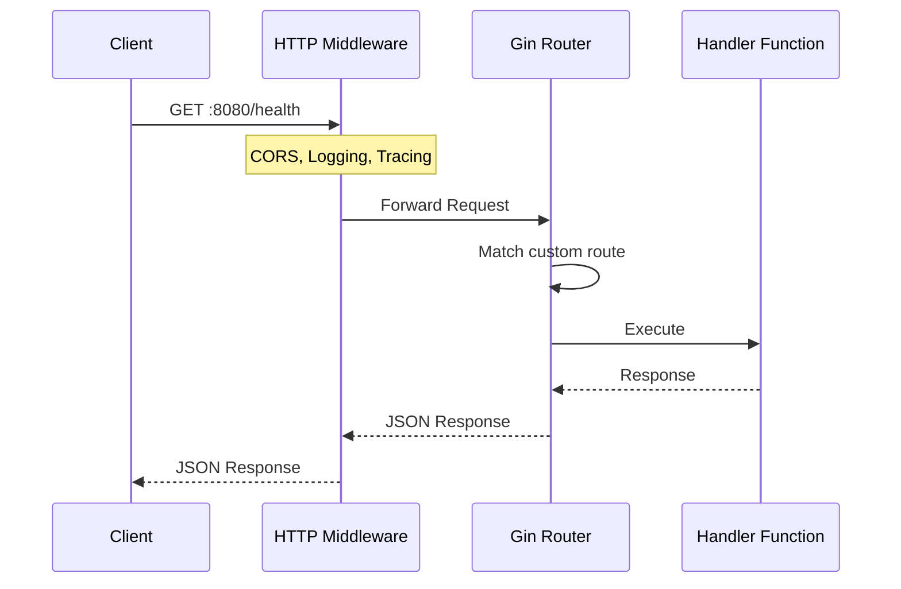

### Обработка задач воркером

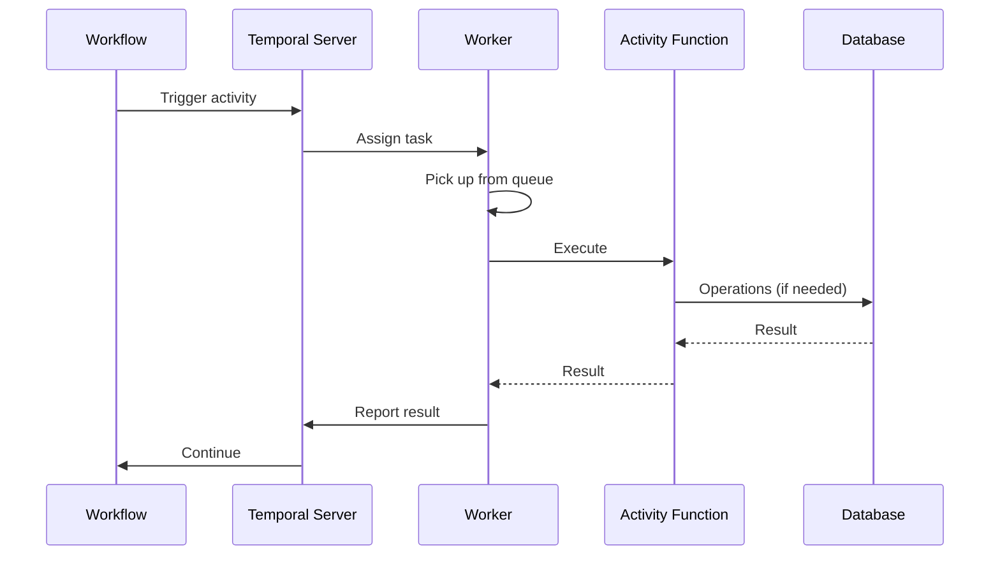

### Обработка сообщений консьюмером

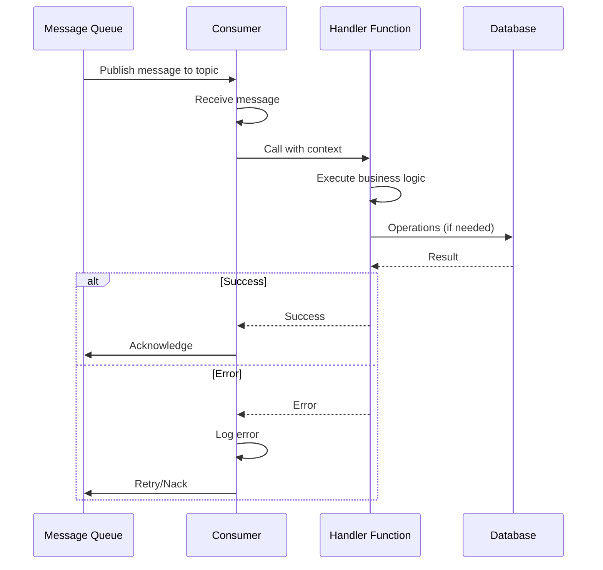

## Управление конфигурацией

Конфигурация следует этому порядку приоритетов (от высшего к низшему):

1. **Код** - Опции, переданные в конструкторы
2. **Переменные окружения** - `APP_NAME`, `DB_DSN` и т.д.
3. **Значения по умолчанию** - Встроенные разумные значения

Пример:
```go
// 1. Code (highest priority)
app := tonica.NewApp(tonica.WithName("myservice"))

// 2. Environment variable
// export APP_NAME="envservice"

// 3. Default (lowest priority)
// Falls back to "tonica-app" if nothing specified
```

См. [Конфигурация](./configuration.md) для всех опций.

## Стратегия обработки ошибок

Tonica использует многоуровневый подход к обработке ошибок:

### Уровень 1: Ошибки приложения
```go
if err != nil {
    return nil, status.Error(codes.InvalidArgument, "invalid user ID")
}
```

### Уровень 2: Ошибки middleware
Автоматически обрабатываются фреймворком:
- HTTP 500 для внутренних ошибок
- HTTP 4xx для ошибок клиента
- Логируются с контекстом

### Уровень 3: Ошибки инфраструктуры
База данных, Redis и т.д.:
```go
import "log/slog"

user, err := db.GetUser(ctx, userID)
if err != nil {
    slog.Error("Failed to get user", "error", err, "user_id", userID)
    return nil, status.Error(codes.Internal, "database error")
}
```

### Уровень 4: Восстановление после паники
Автоматическое восстановление после паники в HTTP/gRPC обработчиках:
- Логирует панику со стеком вызовов
- Возвращает ошибку 500 клиенту
- Не приводит к падению приложения

## Модель конкурентности

### Гарантии потокобезопасности

**App**:
- Безопасно вызывать геттеры конкурентно
- Доступ к реестру защищен мьютексом
- Менеджер метрик потокобезопасен

**Registry**:
- Все операции используют RWMutex
- Разрешено несколько читателей
- Эксклюзивная блокировка на запись

**Services/Workers/Consumers**:
- Каждый запрос/задача/сообщение в отдельной горутине
- Нет общего изменяемого состояния (если не спроектировано явно)
- Отмена на основе контекста

### Управление горутинами

**HTTP сервер**:
- Одна горутина на запрос
- Автоматически очищается после ответа

**gRPC сервер**:
- Одна горутина на поток
- Очищается при закрытии потока

**Воркеры**:
- Настраиваемое количество конкурентных активностей
- Управляются Temporal воркером

**Консьюмеры**:
- Одна горутина на консьюмер
- Обработка сообщений может быть последовательной или параллельной (выбор пользователя)

## Соображения по производительности

### Пулинг соединений

**База данных**:
```go
// Bun handles connection pooling internally
db.SetMaxOpenConns(25)
db.SetMaxIdleConns(10)
db.SetConnMaxLifetime(5 * time.Minute)
```

**Redis**:
```go
// Redis client has built-in connection pool
// Configured via redis.Options
&redis.Options{
    PoolSize:     10,
    MinIdleConns: 5,
}
```

### Стратегия кэширования

1. **Уровень приложения** - Кэши в памяти в вашем коде
2. **Redis** - Распределенный кэш для многоэкземплярных развертываний
3. **База данных** - Кэширование результатов запросов через Bun

### Накладные расходы метрик

Сбор метрик легковесен:
- Инкремент счетчика: ~100нс
- Наблюдение гистограммы: ~500нс
- Незначительное влияние на производительность

## Соображения безопасности

### Аутентификация и авторизация

Не встроена - реализуйте как middleware:

```go
func AuthMiddleware() gin.HandlerFunc {
    return func(c *gin.Context) {
        token := c.GetHeader("Authorization")
        if !validateToken(token) {
            c.AbortWithStatus(401)
            return
        }
        c.Next()
    }
}

app.GetRouter().Use(AuthMiddleware())
```

### CORS

Встроенная поддержка CORS:
```bash
# Allow all origins (default)
# No configuration needed

# Restrict origins
export APP_CORS_ORIGINS="https://myapp.com,https://api.myapp.com"
```

### TLS/HTTPS

Настройка на уровне развертывания:
- Используйте обратный прокси (nginx, Traefik) с терминацией TLS
- Или настройте TLS непосредственно в Gin роутере

## Расширение Tonica

### Пользовательский Middleware

**HTTP Middleware**:
```go
app.GetRouter().Use(MyCustomMiddleware())
```

**gRPC Interceptors**:
```go
grpcServer := grpc.NewServer(
    grpc.UnaryInterceptor(MyInterceptor),
)
```

### Пользовательские метрики

```go
myCounter := app.GetMetricManager().NewCounter("my_metric", "Description")
myCounter.Inc()
```

### Пользовательские проверки работоспособности

```go
tonica.NewRoute(app).
    GET("/health/detailed").
    Handle(func(c *gin.Context) {
        health := map[string]string{
            "database": checkDB(),
            "redis":    checkRedis(),
            "workers":  checkWorkers(),
        }
        c.JSON(200, health)
    })
```

## Следующие шаги

- [Режимы запуска](./run-modes.md) - Узнайте, когда использовать каждый режим
- [Конфигурация](./configuration.md) - Настройте ваше приложение
- [Тестирование](./testing.md) - Пишите тесты для ваших сервисов
- [Лучшие практики](./best-practices.md) - Паттерны для production

## Дополнительное чтение

- [Protocol Buffers](https://protobuf.dev/)
- [gRPC](https://grpc.io/)
- [gRPC-Gateway](https://grpc-ecosystem.github.io/grpc-gateway/)
- [Temporal](https://temporal.io/)
- [Bun ORM](https://bun.uptrace.dev/)
- [OpenTelemetry](https://opentelemetry.io/)
