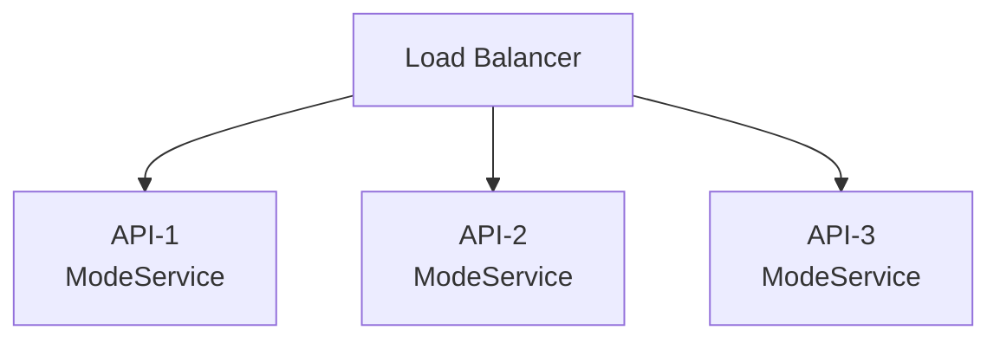
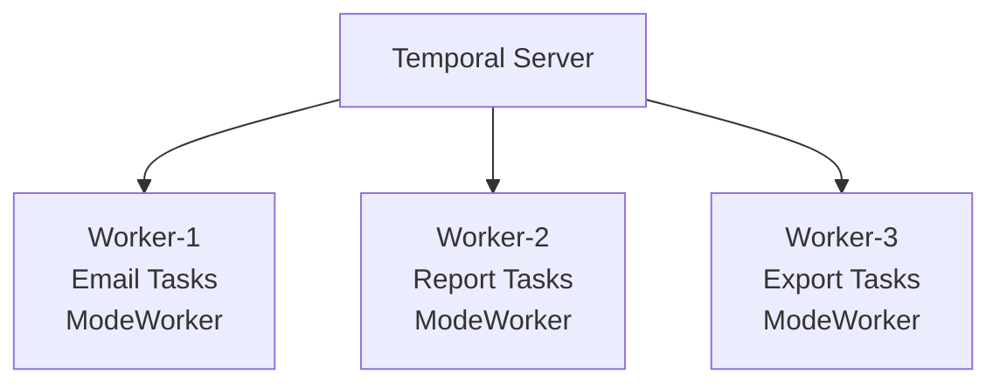
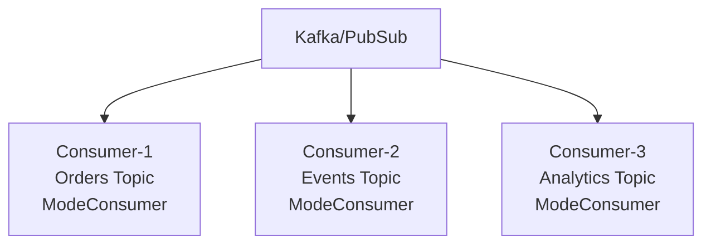
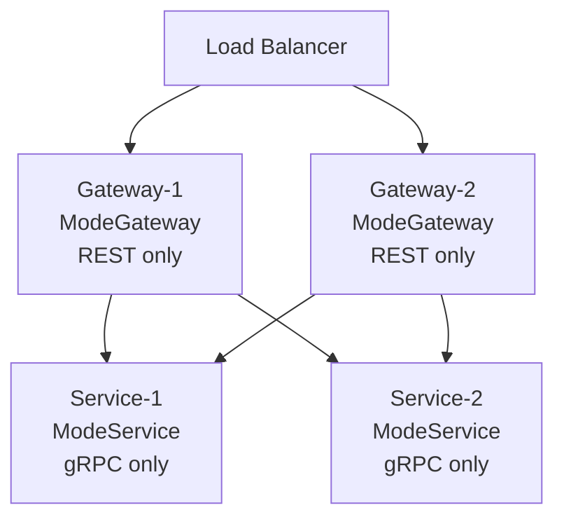
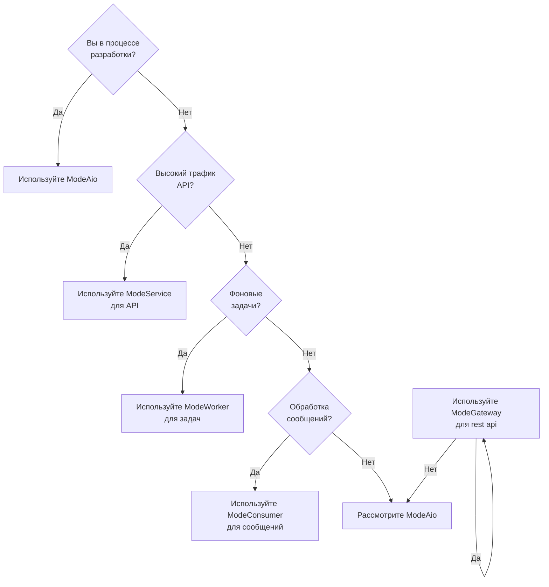

# Режимы запуска Tonica

Tonica поддерживает четыре различных режима запуска, позволяя развертывать ваше приложение как единый сервис или разделять его на специализированные компоненты. Эта гибкость обеспечивает лучшее использование ресурсов и стратегии масштабирования.

## Доступные режимы запуска

| Режим                | Компоненты                                 | Порты             | Сценарий использования                |
|----------------------|--------------------------------------------|-------------------|---------------------------------------|
| **AIO** (All-In-One) | gRPC + REST + Workers + Consumers, Metrics | 8080, 50051, 2121 | Разработка, небольшие развертывания   |
| **Service**          | gRPC, Metrics                              | 50051, 2121       | Масштабирование gRPC слоя             |
| **Worker**           | Temporal workers, Metrics                  | 2121              | Масштабирование фоновых задач         |
| **Consumer**         | Message consumers, Metrics                 | 2121              | Масштабирование обработки сообщений   |
| **Gateway**          | REST, Metrics                              | 8080, 2121        | Масштабирование API слоя              |

## Описание режимов

### ModeAio (All-In-One)

**Описание**: Запускает все компоненты в едином процессе.

**Что запускается:**

- HTTP/REST сервер (порт 8080)
- gRPC сервер (порт 50051)
- Temporal workers
- Потребители сообщений
- Endpoint метрик (порт 2121)
- UI документации OpenAPI

**Пример:**

```go
import (
    "github.com/tonica-go/tonica/pkg/tonica"
    "github.com/tonica-go/tonica/pkg/tonica/config"
    "github.com/tonica-go/tonica/pkg/tonica/service"
    "github.com/tonica-go/tonica/pkg/tonica/worker"
    "github.com/tonica-go/tonica/pkg/tonica/consumer"
)

app := tonica.NewApp(
    tonica.WithConfig(
        config.NewConfig(
            config.WithRunMode(config.ModeAIO),
        ),
    ),
)

// Register services
svc := service.NewService(...)
app.GetRegistry().MustRegisterService(svc)

// Register workers
w := worker.NewWorker(...)
app.GetRegistry().MustRegisterWorker(w)

// Register consumers
c := consumer.NewConsumer(...)
app.GetRegistry().MustRegisterConsumer(c)

// Run in AIO mode
err := app.Run()
```

**Когда использовать:**

- ✅ Среда разработки
- ✅ Небольшие приложения с низким трафиком
- ✅ Proof of concepts
- ✅ Развертывания на одном сервере
- ✅ Когда простота эксплуатации важнее масштабирования

**Когда НЕ использовать:**

- ❌ Высоконагруженная production среда (конкуренция CPU/памяти)
- ❌ Необходимость независимого масштабирования компонентов
- ❌ CPU-интенсивные воркеры, влияющие на задержку API
- ❌ Крупномасштабная обработка сообщений

**Требования к ресурсам:**

```yaml
# Пример ресурсов Kubernetes
resources:
  requests:
    cpu: "1000m"      # Все компоненты вместе
    memory: "1Gi"
  limits:
    cpu: "2000m"
    memory: "2Gi"
```

---

### ModeService

**Описание**: Запускает только API слой (gRPC и REST).

**Что запускается:**

- gRPC сервер (порт 50051)
- Endpoint метрик (порт 2121)

**Что НЕ запускается:**

- Temporal workers
- Потребители сообщений

**Пример:**

```go
import (
    "github.com/tonica-go/tonica/pkg/tonica"
    "github.com/tonica-go/tonica/pkg/tonica/config"
    "github.com/tonica-go/tonica/pkg/tonica/service"
)

app := tonica.NewApp(
    tonica.WithConfig(
        config.NewConfig(
            config.WithRunMode(config.ModeService),
        ),
    ),
)

// Register services ONLY
svc := service.NewService(...)
app.GetRegistry().MustRegisterService(svc)

// DON'T register workers or consumers in this mode

// Run in Service mode
err := app.Run()
```

**Когда использовать:**

- ✅ Production развертывания API
- ✅ Необходимость масштабировать API независимо от воркеров
- ✅ Высокая пропускная способность запросов
- ✅ Требования к низкой задержке
- ✅ Горизонтальное масштабирование API слоя

**Шаблон архитектуры:**



**Пример масштабирования:**

```bash
# Kubernetes Deployment
apiVersion: apps/v1
kind: Deployment
metadata:
  name: myservice-api
spec:
  replicas: 5  # Scale API horizontally
  template:
    spec:
      containers:
      - name: api
        image: myservice:latest
        env:
        - name: RUN_MODE
          value: "service"
        resources:
          requests:
            cpu: "500m"
            memory: "512Mi"
```

**Требования к ресурсам:**

```yaml
# Легче чем AIO - без воркеров/потребителей
resources:
  requests:
    cpu: "500m"       # Только обработка API
    memory: "512Mi"
  limits:
    cpu: "1000m"
    memory: "1Gi"
```

---

### ModeWorker

**Описание**: Запускает только Temporal воркеры для обработки фоновых задач.

**Что запускается:**

- Temporal workers
- Endpoint метрик (порт 2121)

**Что НЕ запускается:**

- HTTP/REST сервер
- gRPC сервер
- Потребители сообщений

**Пример:**

```go
import (
    "github.com/tonica-go/tonica/pkg/tonica"
    "github.com/tonica-go/tonica/pkg/tonica/config"
    "github.com/tonica-go/tonica/pkg/tonica/worker"
    "go.temporal.io/sdk/client"
)

// Create Temporal client
temporalClient, err := client.Dial(client.Options{
    HostPort: "localhost:7233",
})
if err != nil {
    log.Fatal(err)
}

app := tonica.NewApp(
    tonica.WithConfig(
        config.NewConfig(
            config.WithRunMode(config.ModeWorker),
        ),
    ),
)

// Register workers ONLY
w := worker.NewWorker(
    worker.WithName("email-worker"),
    worker.WithQueue("email-tasks"),
    worker.WithClient(temporalClient),
    worker.WithActivities([]interface{}{
        SendEmailActivity,
        GenerateReportActivity,
    }),
)

app.GetRegistry().MustRegisterWorker(w)

// Run in Worker mode
err = app.Run()
```

**Когда использовать:**

- ✅ CPU-интенсивные фоновые задачи
- ✅ Долгие операции (отчеты, экспорты)
- ✅ Пакетная обработка
- ✅ Необходимость масштабировать воркеры независимо
- ✅ Специфичные требования к ресурсам для задач

**Шаблон архитектуры:**



**Специализированные воркеры:**

```go
// Email worker - high concurrency, low CPU
emailWorker := tonica.NewWorker(
tonica.WithWorkerName("email-worker"),
tonica.WithTaskQueue("emails"),
tonica.WithMaxConcurrentActivities(50), // Many concurrent emails
)

// Report worker - low concurrency, high CPU
reportWorker := tonica.NewWorker(
tonica.WithWorkerName("report-worker"),
tonica.WithTaskQueue("reports"),
tonica.WithMaxConcurrentActivities(2), // CPU-intensive reports
)
```

**Требования к ресурсам:**

```yaml
# Email worker (I/O bound)
resources:
  requests:
    cpu: "200m"
    memory: "256Mi"
  limits:
    cpu: "500m"
    memory: "512Mi"

---

# Report worker (CPU bound)
resources:
  requests:
    cpu: "2000m"      # Требуется больше CPU
    memory: "2Gi"
  limits:
    cpu: "4000m"
    memory: "4Gi"
```

---

### ModeConsumer

**Описание**: Запускает только потребителей сообщений для обработки Kafka/PubSub.

**Что запускается:**

- Потребители сообщений
- Endpoint метрик (порт 2121)

**Что НЕ запускается:**

- HTTP/REST сервер
- gRPC сервер
- Temporal workers

**Пример:**

```go
import (
    "context"

    "github.com/tonica-go/tonica/pkg/tonica"
    "github.com/tonica-go/tonica/pkg/tonica/config"
    "github.com/tonica-go/tonica/pkg/tonica/consumer"
    "github.com/tonica-go/tonica/pkg/tonica/storage/pubsub"
    "github.com/tonica-go/tonica/pkg/tonica/storage/pubsub/kafka"
)

// Create Kafka client
kafkaClient := kafka.New(&kafka.Config{
    Brokers:         []string{"localhost:9092"},
    ConsumerGroupID: "order-processors",
}, nil)

app := tonica.NewApp(
    tonica.WithConfig(
        config.NewConfig(
            config.WithRunMode(config.ModeConsumer),
        ),
    ),
)

// Register consumers ONLY
c := consumer.NewConsumer(
    consumer.WithName("order-consumer"),
    consumer.WithTopic("orders"),
    consumer.WithConsumerGroup("order-processors"),
    consumer.WithClient(kafkaClient),
    consumer.WithHandler(func(ctx context.Context, msg *pubsub.Message) error {
        return processOrder(ctx, msg)
    }),
)

app.GetRegistry().MustRegisterConsumer(c)

// Run in Consumer mode
err := app.Run()
```

**Когда использовать:**

- ✅ Высокообъемная обработка сообщений
- ✅ Event-driven архитектуры
- ✅ Потоковая обработка
- ✅ Необходимость масштабировать потребителей независимо
- ✅ Логика обработки специфична для топиков

**Шаблон архитектуры:**



**Множество потребителей:**

```go
// Order consumer - high priority
orderConsumer := tonica.NewConsumer(
tonica.WithConsumerName("order-consumer"),
tonica.WithTopic("orders"),
tonica.WithConsumerGroup("order-processors"),
tonica.WithHandler(processOrder),
)

// Analytics consumer - low priority
analyticsConsumer := tonica.NewConsumer(
tonica.WithConsumerName("analytics-consumer"),
tonica.WithTopic("events"),
tonica.WithConsumerGroup("analytics"),
tonica.WithHandler(processAnalytics),
)

app.GetRegistry().MustRegisterConsumer(orderConsumer)
app.GetRegistry().MustRegisterConsumer(analyticsConsumer)
```

**Требования к ресурсам:**

```yaml
# Ресурсы потребителей зависят от сложности обработки
resources:
  requests:
    cpu: "500m"
    memory: "512Mi"
  limits:
    cpu: "1000m"
    memory: "1Gi"
```

---

### ModeGateway

**Описание**: Запускает только слой HTTP/REST API gateway (без gRPC сервера).

**Что запускается:**

- HTTP/REST сервер (порт 8080)
- gRPC-Gateway (проксирует REST запросы к backend gRPC сервисам)
- Кастомные маршруты
- UI документации OpenAPI
- Endpoint метрик (порт 2121)

**Что НЕ запускается:**

- gRPC сервер (вместо этого подключается к внешним gRPC сервисам)
- Temporal workers
- Потребители сообщений

**Пример:**

```go
import (
    "github.com/gin-gonic/gin"
    "github.com/tonica-go/tonica/pkg/tonica"
    "github.com/tonica-go/tonica/pkg/tonica/config"
)

app := tonica.NewApp(
    tonica.WithSpec("openapi/spec.json"),
    tonica.WithConfig(
        config.NewConfig(
            config.WithRunMode(config.ModeGateway),
        ),
    ),
)

// Don't register services directly - gateway proxies to external gRPC servers
// Just configure custom routes if needed
tonica.NewRoute(app).
    GET("/health").
    Handle(func(c *gin.Context) {
        c.JSON(200, gin.H{"status": "healthy"})
    })

// Run in Gateway mode
err := app.Run()
```

**Когда использовать:**

- ✅ Отделение REST API слоя от gRPC сервисов
- ✅ Независимое масштабирование API gateway
- ✅ Edge слой для множества backend сервисов
- ✅ Rate limiting и кеширование API на уровне gateway
- ✅ Публичный REST API с приватными gRPC backend'ами

**Шаблон архитектуры:**



**Пример использования:**

```
┌─────────────┐
│   Clients   │ (Mobile, Web, и т.д.)
└──────┬──────┘
       │ HTTP/REST
       ↓
┌─────────────┐
│  Gateways   │ ModeGateway (масштабировано: 10 реплик)
│  Port 8080  │ - Rate limiting
└──────┬──────┘ - Caching
       │ gRPC   - Auth
       ↓
┌─────────────┐
│  Services   │ ModeService (масштабировано: 5 реплик)
│  Port 50051 │ - Бизнес-логика
└─────────────┘ - Доступ к базе данных
```

**Требования к ресурсам:**

```yaml
# Gateway легковесный - только проксирование
resources:
  requests:
    cpu: "200m"
    memory: "256Mi"
  limits:
    cpu: "500m"
    memory: "512Mi"
```

**Конфигурация:**

Направьте gateway на backend gRPC сервисы:

```bash
# Service addresses
export USERSERVICE_ADDR="user-service:50051"
export ORDERSERVICE_ADDR="order-service:50051"
export PAYMENTSERVICE_ADDR="payment-service:50051"
```

## Выбор правильного режима

### Дерево решений



### Шаблоны развертывания

#### Шаблон 1: Разработка

```yaml
# Один контейнер
services:
  app:
    image: myservice:latest
    environment:
      RUN_MODE: aio
    ports:
      - "8080:8080"   # HTTP
      - "50051:50051" # gRPC
      - "9090:9090"   # Metrics
```

#### Шаблон 2: Небольшой Production

```yaml
# Разделенные API и воркеры
services:
  gateway:
    image: myservice:latest
    environment:
      RUN_MODE: gateway
    replicas: 3
    ports:
      - "8080:8080"

  api:
    image: myservice:latest
    environment:
      RUN_MODE: service
    replicas: 3
    ports:
      - "8080:8080"
      - "50051:50051"

  worker:
    image: myservice:latest
    environment:
      RUN_MODE: worker
    replicas: 2
```

#### Шаблон 3: Большой Production

```yaml
# Полностью разделенные компоненты
services:
  gateway:
    image: myservice:latest
    environment:
      RUN_MODE: gateway
    replicas: 10       # Масштабирование API независимо

  api:
    image: myservice:latest
    environment:
      RUN_MODE: service
    replicas: 10       # Масштабирование API независимо

  email-worker:
    image: myservice:latest
    environment:
      RUN_MODE: worker
      WORKER_TASK_QUEUE: emails
    replicas: 5

  report-worker:
    image: myservice:latest
    environment:
      RUN_MODE: worker
      WORKER_TASK_QUEUE: reports
    replicas: 2
    resources:
      cpu: "4000m"     # Больше CPU для отчетов

  order-consumer:
    image: myservice:latest
    environment:
      RUN_MODE: consumer
      CONSUMER_TOPIC: orders
    replicas: 3
```

## Конфигурация режима

### Через переменную окружения

```bash
# Set run mode via environment
export APP_MODE="service"
```

```go
import (
    "github.com/tonica-go/tonica/pkg/tonica"
    "github.com/tonica-go/tonica/pkg/tonica/config"
)

// In your code, read from environment
app := tonica.NewApp(
    tonica.WithConfig(
        config.NewConfig(
            config.WithRunMode(
                config.GetEnv("APP_MODE", config.ModeAIO), // Read from env with default
            ),
        ),
    ),
)

err := app.Run()
```

### Через код

```go
import (
    "github.com/tonica-go/tonica/pkg/tonica"
    "github.com/tonica-go/tonica/pkg/tonica/config"
)

// Hardcode the mode
app := tonica.NewApp(
    tonica.WithConfig(
        config.NewConfig(
            config.WithRunMode(config.ModeService),
        ),
    ),
)

err := app.Run()
```

### Через флаг командной строки

```go
import (
    "flag"
    "github.com/tonica-go/tonica/pkg/tonica"
    "github.com/tonica-go/tonica/pkg/tonica/config"
)

func main() {
    mode := flag.String("mode", config.ModeAIO, "Run mode: aio, service, worker, consumer, gateway")
    flag.Parse()

    app := tonica.NewApp(
        tonica.WithConfig(
            config.NewConfig(
                config.WithRunMode(*mode),
            ),
        ),
    )

    err := app.Run()
    if err != nil {
        log.Fatal(err)
    }
}
```

## Graceful Shutdown во всех режимах

Все режимы поддерживают graceful shutdown (обрабатывается внутри фреймворка):

```go
import (
    "context"
    "os"
    "os/signal"
    "syscall"

    "github.com/tonica-go/tonica/pkg/tonica"
    "github.com/tonica-go/tonica/pkg/tonica/config"
)

app := tonica.NewApp(
    tonica.WithConfig(
        config.NewConfig(
            config.WithRunMode(config.ModeAIO),
        ),
    ),
)

// Graceful shutdown is handled automatically by the framework
// It listens for SIGINT/SIGTERM signals
err := app.Run()
```

**Поведение Shutdown по режимам:**

| Режим        | Процесс Shutdown                                                                                                                                                                                          |
|--------------|-----------------------------------------------------------------------------------------------------------------------------------------------------------------------------------------------------------|
| **AIO**      | 1. Прекратить принимать новые HTTP/gRPC запросы<br/>2. Дождаться завершения активных запросов (30с)<br/>3. Остановить воркеры<br/>4. Дождаться завершения текущего сообщения потребителями (5с)<br/>5. Закрыть соединения |
| **Service**  | 1. Прекратить принимать новые запросы<br/>2. Дождаться завершения активных запросов (30с)<br/>3. Закрыть соединения                                                                                             |
| **Worker**   | 1. Прекратить принимать новые задачи<br/>2. Дождаться завершения текущих задач<br/>3. Закрыть Temporal соединение                                                                                                |
| **Consumer** | 1. Прекратить принимать новые сообщения<br/>2. Дождаться завершения обработки текущего сообщения (5с)<br/>3. Закрыть соединение с очередью сообщений                                                                  |
| **Gateway**  | 1. Прекратить принимать новые HTTP запросы                                                                                                                                                                     |

## Мониторинг каждого режима

### Метрики по режимам

Все режимы предоставляют метрики на порту 2121:

```bash
curl http://localhost:2121/metrics
```

**Специфичные метрики режимов:**

**ModeService:**

- `http_requests_total`
- `http_request_duration_seconds`
- `grpc_requests_total`
- `grpc_request_duration_seconds`

**ModeWorker:**

- `temporal_activity_execution_total`
- `temporal_activity_duration_seconds`
- `temporal_activity_errors_total`

**ModeConsumer:**

- `consumer_messages_processed_total`
- `consumer_messages_failed_total`
- `consumer_processing_duration_seconds`

### Health Checks

Добавьте специфичные для режима health checks:

```go
tonica.NewRoute(app).
GET("/health").
Handle(func (c *gin.Context) {
health := gin.H{
"status": "healthy",
"mode":   "service", // or worker, consumer
}

// Add mode-specific checks
if mode == "worker" {
health["workers"] = len(app.GetRegistry().GetAllWorkers())
}

c.JSON(200, health)
})
```

## Распространенные ошибки

### ❌ Регистрация неправильных компонентов

```go
import (
    "github.com/tonica-go/tonica/pkg/tonica"
    "github.com/tonica-go/tonica/pkg/tonica/config"
    "github.com/tonica-go/tonica/pkg/tonica/worker"
)

// НЕ ДЕЛАЙТЕ ТАК: Регистрация воркеров при запуске в режиме Service
app := tonica.NewApp(
    tonica.WithConfig(
        config.NewConfig(
            config.WithRunMode(config.ModeService),
        ),
    ),
)
w := worker.NewWorker(...)
app.GetRegistry().MustRegisterWorker(w)
err := app.Run() // Воркер не запустится в режиме Service!
```

### ✅ Регистрация подходящих компонентов

```go
import (
    "github.com/tonica-go/tonica/pkg/tonica"
    "github.com/tonica-go/tonica/pkg/tonica/config"
    "github.com/tonica-go/tonica/pkg/tonica/service"
)

// ДЕЛАЙТЕ ТАК: Регистрируйте только сервисы при запуске в режиме Service
app := tonica.NewApp(
    tonica.WithConfig(
        config.NewConfig(
            config.WithRunMode(config.ModeService),
        ),
    ),
)
svc := service.NewService(...)
app.GetRegistry().MustRegisterService(svc)
err := app.Run() // Правильно!
```

### ❌ Конфликты портов

```go
// НЕ ДЕЛАЙТЕ ТАК: Запуск нескольких экземпляров в режиме Service на одном хосте
// Оба пытаются привязаться к портам 8080 и 50051
```

### ✅ Используйте разные хосты или контейнеры

```yaml
# ДЕЛАЙТЕ ТАК: Запускайте в отдельных контейнерах/хостах
services:
  api-1:
    ports: [ "8080:8080" ]
  api-2:
    ports: [ "8081:8080" ]  # Сопоставить с другим внешним портом
```

## Продвинутое: Динамический выбор режима

```go
import (
    "os"

    "github.com/tonica-go/tonica/pkg/tonica"
    "github.com/tonica-go/tonica/pkg/tonica/config"
    "github.com/tonica-go/tonica/pkg/tonica/service"
    "github.com/tonica-go/tonica/pkg/tonica/worker"
    "github.com/tonica-go/tonica/pkg/tonica/consumer"
)

func main() {
    mode := config.GetEnv("APP_MODE", config.ModeAIO)

    app := tonica.NewApp(
        tonica.WithConfig(
            config.NewConfig(
                config.WithRunMode(mode),
            ),
        ),
    )

    // Create components
    svc := service.NewService(...)
    w := worker.NewWorker(...)
    c := consumer.NewConsumer(...)

    // Register based on mode
    switch mode {
    case config.ModeService:
        app.GetRegistry().MustRegisterService(svc)
    case config.ModeWorker:
        app.GetRegistry().MustRegisterWorker(w)
    case config.ModeConsumer:
        app.GetRegistry().MustRegisterConsumer(c)
    case config.ModeGateway:
        // No components needed for gateway
    default: // config.ModeAIO
        app.GetRegistry().MustRegisterService(svc)
        app.GetRegistry().MustRegisterWorker(w)
        app.GetRegistry().MustRegisterConsumer(c)
    }

    err := app.Run()
    if err != nil {
        log.Fatal(err)
    }
}
```

## Резюме

| Режим        | Разработка  | Production    | Масштабирование                | Эффективность ресурсов |
|--------------|-------------|---------------|--------------------------------|------------------------|
| **AIO**      | ✅ Отлично  | ⚠️ Только малый | ❌ Ограничено                 | ⚠️ Средняя             |
| **Service**  | ✅ Хорошо   | ✅ Отлично     | ✅ Горизонтальное              | ✅ Высокая             |
| **Worker**   | ✅ Хорошо   | ✅ Отлично     | ✅ Горизонтальное + Вертикальное | ✅ Высокая           |
| **Consumer** | ✅ Хорошо   | ✅ Отлично     | ✅ Горизонтальное              | ✅ Высокая             |
| **Gateway**  | ✅ Хорошо   | ✅ Отлично     | ✅ Горизонтальное              | ✅ Высокая             |

**Рекомендация**: Начните с **ModeAio** для разработки, затем разделите на **ModeService** + **ModeWorker** + **ModeConsumer** для production.

## Следующие шаги

- [Configuration](./configuration.md) - Настройка каждого режима
- [Best Practices](./best-practices.md) - Паттерны production развертывания
- [Testing](./testing.md) - Тестирование каждого режима независимо
